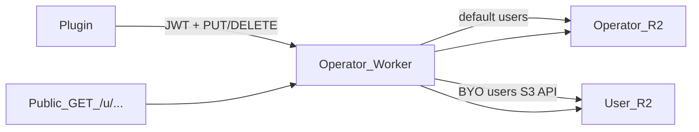

# BYO Cloudflare R2 (optional storage)

## Decision (locked)

- **Default:** today’s stack — operator Worker + operator private R2 (`[cloud/](cloud/)`, `[doc/TECHNICAL.md](doc/TECHNICAL.md#cloud-publish)`).
- **Optional:** user connects their Cloudflare account; Worker creates/links a private R2 bucket and stores scoped S3 credentials.
- **Public URLs stay on your Worker** (`https://read.…/u/{userId}/…`). No change to share-link shape. Reads/writes for that `userId` go to **their** bucket over the R2 S3 API; you still pay Workers requests on views (accepted tradeoff for familiar URLs).



## Non-goals (v1)

- Deploying a full Worker clone into the user’s account.
- Google Drive / Proton / WebDAV.
- Auto-migrating existing hosted objects into BYO (user re-Publishes / Syncs after connect).
- Removing per-user quota for BYO (still enforce `USER_QUOTA_BYTES` — BYO offloads storage £, not viral request abuse).

## Architecture

### Storage abstraction in the Worker

Today all object I/O uses `env.BUCKET` (`[cloud/src/index.ts](cloud/src/index.ts)`). Split:

1. **Control plane** (always operator R2): OAuth ready blobs, anything not under `users/{userId}/`.
2. **User content** (`users/{userId}/…`): resolve via `getContentStore(env, userId)`:

- no BYO record → `env.BUCKET` (current behaviour)
- BYO record → S3-compatible client against `https://{accountId}.r2.cloudflarestorage.com` / bucket name

Implement a thin `ContentStore` interface (`get` / `head` / `put` / `delete` / `list`) wrapping native `R2Bucket` and an `aws4fetch`-style R2 client. Route **public** `/u/{userId}/…` and **authenticated** `/v1/`* object ops through it. Keep quota KV (`usage:{userId}`) as today.

### Credential model (KV)

```text
storage:{zoteroUserId} → {
  provider: "cloudflare-r2",
  accountId, bucket, accessKeyId,
  secretAccessKeyEnc,   // encrypt with Worker secret STORAGE_CRED_KEY
  endpoint,             // R2 S3 API URL
  connectedAt
}
```

Never return secrets to the plugin. `/v1/me` gains `storage: { mode: "hosted" | "cloudflare-r2", bucket?, connectedAt? }`.

### Cloudflare connect flow

Mirror existing Zotero OAuth start/poll pattern in `[publishAuth.ts](src/utils/publishAuth.ts)` / Worker auth routes:

1. Plugin (prefs or publish wizard secondary action): **Connect Cloudflare storage…**
2. `POST /auth/cloudflare/start` (requires valid Zotero publish JWT) → browser consent for a **public Cloudflare OAuth client** you register (scopes: enough to create R2 bucket + create scoped R2 API token; not full account nuke if CF scope granularity allows).
3. Callback on Worker → create private bucket `zotero-syllabus-{userId}` (or stable name) → create R2 S3 API token scoped to that bucket → encrypt + KV put `storage:{userId}` → success page.
4. Plugin polls `/auth/cloudflare/poll` (or refreshes `/v1/me`) and shows connected state.

**Disconnect:** `DELETE /v1/storage` clears KV credentials; subsequent I/O uses hosted R2 again. Document that objects left in the user’s bucket are orphaned (user deletes in Cloudflare dashboard if desired).

**Switch warning:** connecting BYO while live publishes exist on hosted R2 → UI copy that public links will 404 until **Sync / Publish** again (v1: no dual-read fallback, simpler).

### Plugin / prefs

- Keep `publishApiBaseUrl` pointing at **your** Worker always for this feature (BYO is storage behind the same API, not a different base URL).
- Prefs (or publish status UI): storage mode + Connect / Disconnect; reuse Fluent (`[addon/locale/*/addon.ftl](addon/locale/en-US/addon.ftl)`).
- No change to upload pipeline in `[publishCollection.ts](src/utils/publishCollection.ts)` / `[publishItem.ts](src/utils/publishItem.ts)` / `[publishAuth.ts](src/utils/publishAuth.ts)` beyond surfacing storage status and the connect OAuth helpers.

### Worker secrets / config

New secrets: `CLOUDFLARE_OAUTH_CLIENT_ID`, `CLOUDFLARE_OAUTH_CLIENT_SECRET`, `STORAGE_CRED_KEY`. Document in `[cloud/README.md](cloud/README.md)` + `[doc/TECHNICAL.md](doc/TECHNICAL.md)`.

### Admin dashboard

List `storage` mode per user; for BYO users, size/list via their credentials or show “external” without full scan if listing is expensive. Delete-admin still works through `ContentStore`.

## Docs (same change)

- Website: `[website/src/content/docs/how-to/print-export-publish.md](website/src/content/docs/how-to/print-export-publish.md)` — optional own-Cloudflare storage, connect/disconnect, re-publish note.
- `[README.md](README.md)` — one-line mention under publish.
- `[doc/TECHNICAL.md](doc/TECHNICAL.md)` — BYO credential layout, trust boundary (plugin never sees R2 keys; Worker holds encrypted S3 keys), control-plane vs content-plane split.

## Trust / cost notes (product)

- Plugin remains untrusted; only Zotero JWT + CF OAuth browser consent.
- BYO reduces **your R2 GB**; it does **not** remove Workers Free **100k req/day** risk on public views — still rely on quotas + CF spend alerts.
- Consent screen will ask for R2/token create permissions — keep copy honest.

## Suggested implementation order (when returning)

1. `ContentStore` + hosted path unchanged (refactor only).
2. Manual BYO via wrangler-created creds in KV (dev/test without OAuth).
3. Cloudflare OAuth connect/disconnect + encrypt.
4. Plugin UI + Fluent + `/v1/me` storage field.
5. Admin + docs.
