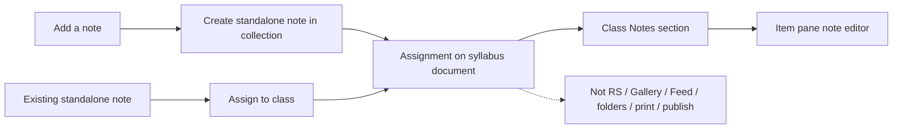

# Class-assignable notes

Standalone notes in a syllabus collection can be assigned to a class. They appear only in a **Notes** block on the Syllabus tab (not mixed with readings). Creation is one click; opening is `ZoteroPane.selectItem` so the native note editor is the editor.

## Membership rules

Add helpers in `[src/utils/items.ts](src/utils/items.ts)` next to `isStandaloneAttachment`:

- `**isClassNoteItem**`: top-level, not deleted, `isNote()`, **not** tagged `zotero-syllabus` (the collection Syllabus document).
- `**isAssignedClassNote**`: that plus a key in the collection document’s `items`.
- `**isSyllabusAssignableItem**`: regular item, standalone attachment, **or** class note.

Unassigned class notes stay out of the Syllabus view (same as unassigned standalone files). Assign via the new button, item pane, or **Assign to class**.

Do not add a new tag. Assignment in the syllabus note is the source of truth.

## Where they appear vs stay out

**In:** Syllabus tab, per-class Notes section. Item pane + context menu so existing notes can be assigned.

**Out (keep current filters or add a note skip):**

- Reading Schedule / Home class shelves: `[useSyllabi.ts](src/modules/react-zotero-sync/useSyllabi.ts)` stays `isSyllabusMemberItem`.
- Gallery: `[collectionItems.ts](src/modules/react-zotero-sync/collectionItems.ts)` only includes **assigned** class notes for the Syllabus tab path; Gallery should keep excluding notes (pass a flag or split “syllabus members” vs “gallery members” so Gallery does not pick them up).
- Annotation Feed: already annotation-parented; leave it.
- Further reading: `[classGroups.ts](src/modules/classGroups.ts)` must not dump notes there.
- Class folders: `[desiredItemKeysForClass](src/modules/classSubcollections.ts)` skip notes so folders stay reading shelves.
- Publish HTML: `[gatherClassReadings](src/modules/syllabusNoteHtml.ts)` already requires `isRegularItem()`; keep that.
- Print: Notes section uses `in-[.print]:hidden`.
- Pin / reading done / priority: not on notes.

**Critical heal path:** `[documentHasOrphanItemKeys](src/modules/syllabusNote.ts)` today treats a live note as an orphan and would remap it. Extend the live-member check to `isClassNoteItem` so assigned notes are not “healed” onto a book.

## Data and grouping

Reuse existing assignments (`document.items[noteKey]` + `classId`). No schema change.

Update `[buildSyllabusClassGroups](src/modules/classGroups.ts)` to return `noteAssignments` per class (assigned class notes only) and leave `itemAssignments` as readings/files. Sort notes by title (v1: no drag-reorder, no duplicate).

`[useZoteroCollectionItems](src/modules/react-zotero-sync/collectionItems.ts)`: include assigned class notes in the Syllabus listing (`isAssignedClassNote`), and subscribe to note `modify` so titles/snippets update while typing.

`[useZoteroItemAssignments](src/modules/react-zotero-sync/itemAssignments.ts)`: load assignments for class notes, not only `isSyllabusMemberItem`.

Context menus in `[syllabus.ts](src/modules/syllabus.ts)` (`Assign to class`, not pin / gallery-note / set-priority / reading-status): use `isSyllabusAssignableItem` so notes can be assigned. Skip the Syllabus document note.

## Syllabus UI

In `[ClassGroup.tsx](src/modules/ClassGroup.tsx)`, after the readings list, a **Notes** block (`in-[.print]:hidden`):

- Always shown when unlocked (empty state + add). When locked, only if there are notes.
- Heading + **Add a note** (Plus, same chrome as other class header buttons).
- Rows: title (`getItemTitle`), optional snippet from `readItemNote`, click → `selectItemInCollection`. Hover: unassign (existing `onDelete`), not trash.
- Not `SyllabusItemCard` (covers, reading time, done, duplicate).

New helper (e.g. `[src/modules/classNote.ts](src/modules/classNote.ts)`), following the Zotero 8 create pattern in `[pinned.ts](src/modules/pinned.ts)` (`saveTx` before `setNote` / `addToCollection`):

1. `new Zotero.Item("note")` in the collection library.
2. Starter HTML whose first line is the class label (nomenclature + number + title) so the items list is scannable.
3. Add to the parent collection (not the class folder).
4. `addClassAssignment` for that class.
5. `selectItem` so the note editor opens.

Hide the add button when the syllabus is locked or the library is not editable.

Item pane: for a class note, keep class assignment; hide pin controls (already `isRegularItem`) and reading priority/done.

## Localization

New kebab-case keys in **every** `[addon/locale/*/addon.ftl](addon/locale/en-US/addon.ftl)` (not `syllabus-` prefixed), e.g. `class-notes`, `class-add-note`, `class-note-unassign`. Call `getString` at render time.

## Tests and docs

- `[test/classGroups.test.ts](test/classGroups.test.ts)`: assigned note → `noteAssignments`; syllabus document note skipped; unassigned note not listed; readings unchanged.
- Orphan/heal: a live class note is not an orphan; parented child notes still are not assignable.
- Optional: class-folder desired keys omit notes.

Short README + `[doc/TECHNICAL.md](doc/TECHNICAL.md)` note: class notes are private, unpublished, Syllabus-tab only.