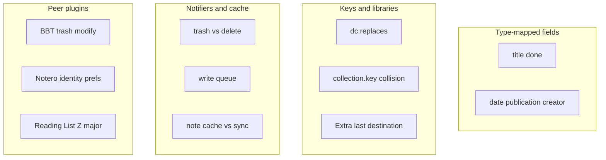

# Robustness catalog

Recent work fixed **display titles** (`getDisplayTitle`) and **item-merge remapping** (`dc:replaces`). This catalog keeps those leftovers and adds every other family that can silently drop assignments, show Untitled, fight Zotero sync, or break on groups / Zotero 8–10.

Peers that keep hitting the same classes of bug (issue patterns, not code to copy):

- [Better BibTeX](https://github.com/retorquere/zotero-better-bibtex) — notifier races (`trash` without `collection-item`; `modify` on already-deleted items; delay before touching collections; skip feed items; `getNote()` throws on non-notes in Z9)
- [Notero](https://github.com/dvanoni/notero) — identity keyed off a foreign id (URL) → duplicates; prefs list stale after collection rename/delete; standalone PDFs; “My Library” vs collection; descendants not included
- [zotero-reading-list](https://github.com/Dominic-DallOsto/zotero-reading-list) (we already read Extra from it) — Zotero 8/9/10 churn; prefs overwrite on sync; tag updates wiping other tags; batch limits
- [Better Notes](https://github.com/windingwind/zotero-better-notes) — plugin data inside notes; both-sides-edited sync conflicts; auto-sync hangs on large notes
- [Zotlit](https://github.com/aidenlx/zotlit) — capture `libraryID` at notify time because the item may already be gone; collapse notifier batches

Tests today: title helper, merge remap unit + smoke, note HTML round-trip, gallery nav math, startup selection APIs. Almost none of the families below have coverage.

---

## A. Type-mapped fields (same as the Reddit title bug)

Zotero only maps base fields if you pass `includeBaseMapped`: `getField(field, false, true)`. Title is fixed via `getDisplayTitle()`. Remaining empties:

- **Date** — [SyllabusItemCard](src/modules/SyllabusItemCard.tsx), [sortItemsByDate](src/utils/items.ts), [journalYear](src/modules/GalleryPage.tsx), [cite.ts](src/utils/cite.ts). Empty for case `dateDecided`, statute `dateEnacted`, patent `issueDate`.
- **Publication** — card falls back to `bookTitle` only. Still empty for webpage / blog / forum / encyclopedia / dictionary / proceedings / TV-radio `programTitle`.
- **Publisher** (cite fallback) — thesis `university`, report `institution`, film `distributor`, audio `label`, video `studio`, software `company`.
- **Pages / reading time** — case `firstPage`, bill `codePages`. `runningTime` via `parseInt` turns `"1:30:00"` into `1`. Page field `"iv, 1–200"` parses the first digits.
- **Creators** — Gallery [itemAuthorLine](src/modules/GalleryPage.tsx) prefers `author`; patents/films/interviews/podcasts disagree with cards (`firstCreator`).
- **Letters/interviews** — untitled items already get synthesized titles from `getDisplayTitle`. Import title-match can false-positive on “Letter to Smith”.

Helper shape if we ever fix: `getItemField(item, field)` with `includeBaseMapped`; keep `getItemTitle` on `getDisplayTitle()`.

BBT analogue: citekey generation from title/date on legal items; they learned to use mapped fields.

---

## B. Item and collection identity

### Merges (follow-up to `ec21c7d`)

- **Library-unscoped remap** — [anyCachedDocumentHasItemKey](src/modules/syllabusNote.ts) / [applyItemKeyRemapToCachedDocuments](src/modules/syllabusNote.ts) match `item.key` only. Keys are unique per library. A My Library merge can rewrite a group syllabus that happens to use the same 8-char key. Startup heal is already library-scoped.
- Merge flash (Further reading, then jump back).
- Restore loser / Duplicate Item / copy-to-group: new or restored key, no `dc:replaces`.
- Duplicate Collection: same items, possibly a shared or copied syllabus note.
- Same item in two syllabi; 3-way merge; loser assigned and winner not yet in the collection.
- [collectionItems.ts](src/modules/react-zotero-sync/collectionItems.ts) listens to `add`/`modify`/`delete`, **not `trash`**. BBT: *trashing does not trigger `collection-item`*. Refresh today rides `collection-item` if Zotero fires it; if not, list goes stale.

### Collection keys

[getAllCollections](src/utils/zotero.ts) dedupes with `collectionMap.set(collection.key, collection)` — **no `libraryID`**. Two libraries with the same collection key: one syllabus vanishes from `useSyllabi` / index walks. Item cache keys by numeric id (OK); collection cache uses `libraryID:key` (OK). This helper is the hole.

Notero analogue: deleted/renamed collections linger in prefs ([#775](https://github.com/dvanoni/notero/issues/775)). Our `collectionViewModes` is keyed by collection **id**, which is also stale after recreate.

### Extra absorb

[moveItemIntoCollection](src/modules/syllabusExtra.ts) is called **per destination**. Each call strips every other collection, so Extra naming two syllabi → item only in the last, while assignments are written to both notes.

Also: stale Extra ref → Extra never cleared, retries forever. Connector double-POST: 90s reuse by URL; different title → leftover empty syllabi. Absorb skipped on class folders (Extra may linger).

Notero analogue: identity mismatch → duplicate pages ([#823](https://github.com/dvanoni/notero/issues/823)).

### Import matching (`remapDocumentItemKeys`)

DOI URL vs bare; ISBN-10 vs 13; no PMID/PMCID/arXiv; title-only first-wins.

---

## C. Notifiers, cache, write queue (BBT / Zotlit)

- **Item cache** ([cache.ts](src/utils/cache.ts)) invalidates on `modify`/`delete` only — **not `trash`/`add`/`restore`**. Ghost items after trash; stale objects after restore. Zotlit captures `libraryID` in the notify callback because `Items.get` is already empty on delete.
- BBT explicitly ignores `modify` when `item.deleted` (otherwise trashed items get reinstated). Worth checking our note/Extra handlers.
- BBT skips `isFeedItem`. We filter `isRegularItem()`; feeds may still sneak in depending on version.
- **Write-inflight skip** — `handleNoteChange` skips reparse while a local write is in flight. Sync-in during a write can drop remote edits until a later event.
- **documentForWrite** unions note + cache. Two devices editing different classes can resurrect deleted classes. Empty/corrupt HTML keeps the non-empty cache (`skipReparseUntilVersion`).
- **enqueueWrite** serializes by `libraryID:key`. Nested `mutateCollectionDocument` from class-folder ensure = deadlock (called out in [TECHNICAL.md](doc/TECHNICAL.md)). Failed write may still leave `setCacheEntry` mid-mutate.
- `getNote()` on a non-note throws in Zotero 9 (BBT [#3541](https://github.com/retorquere/zotero-better-bibtex/commit/947c3f4c515c11a54bf00ae91f4ff5b0b07becb0)). Our note paths should stay behind `isNote()`.

---

## D. Notes as source of truth (Better Notes)

The syllabus lives in a collection note: readable HTML + `<pre data-zotero-syllabus>` JSON ([syllabusNoteHtml.ts](src/modules/syllabusNoteHtml.ts)).

- User edits the readable prose / breaks `<pre>` → fallback grabs the first `{`…`}` (could be a citation).
- Newer plugin writes a future `version` → older plugin **refuses writes** (`isUnsupportedFutureNote`) but coerce-downgrade may still parse elsewhere → asymmetric.
- Startup format-patch rewrite vs unsynced local edits → Zotero sync conflict dialog (same class as Better Notes both-sides-edited notes).
- Large notes: Better Notes hangs Zotero on auto-sync; we rewrite the whole note HTML on every mutate.
- Duplicate syllabus notes in one collection (import leftovers) — we trash some empties, not all.

---

## E. Class folders and reading schedule

**Class folders** ([classSubcollections.ts](src/modules/classSubcollections.ts)): one-way from note. User rename races `folderSyncHold`. A real child named `Week 1: …` can be adopted or erased. Read-only group: ensure no-ops; Settings still shows the toggle. Turning folders **on** can delete extra children; turning **off** leaves leftovers (documented).

**Reading schedule** ([readingScheduleCollection.ts](src/modules/readingScheduleCollection.ts)): **My Library only**. Group-only syllabi never appear. Dates outside the 10-day window drop folders. Pref-off `eraseTx`s the tree. Notero analogue: “Sync Items” does nothing on My Library root ([#706](https://github.com/dvanoni/notero/issues/706)) — we have the inverse gap.

---

## F. Groups, permissions, Zotero majors (Reading List / BBT)

- BBT: read-only groups don’t get citekeys / native fields. We skip folder ensure when `!collectionLibraryIsEditable`; Extra absorb / import / item pane may still show write UI.
- Joining a synced group (BBT [#3311](https://github.com/retorquere/zotero-better-bibtex/issues/3311)): new keys, our notes still hold old keys.
- Reading List: Zotero 8, then 9, then 10 incompat ([#85](https://github.com/Dominic-DallOsto/zotero-reading-list/issues/85)–[#95](https://github.com/Dominic-DallOsto/zotero-reading-list/issues/95)); we already dual-path selection APIs and bump `strict_max_version`. Right-click / item-pane chrome broke on Z9 beta for them.
- Reading List [#83](https://github.com/Dominic-DallOsto/zotero-reading-list/issues/83): **prefs overwrite on sync**. Our view modes, gallery sort/group, WPM, compact mode are prefs (do not sync). Collection content is in notes (does). Users will expect gallery layout to follow the library.
- [featureFlags.ts](src/modules/featureFlags.ts): schedule + translators off on Zotero 7 (silent from the user’s POV).
- Interop: we read Reading List Extra `Read_Status`. Their tag-sync once wiped other tags ([#87](https://github.com/Dominic-DallOsto/zotero-reading-list/issues/87)); we should not write that Extra.

---

## G. Import, translators, print, gallery, chrome

- Zotero 7: no Connector translators/endpoints. Port rewrite 23119/23124; partial install has no fail popup. Concurrent POSTs vs 90s reuse.
- Print: HiddenBrowser clip, Save-to-PDF vs last printer, YouTube embeds, temp-file cleanup.
- Gallery keyboard: capture-phase on `document`; staggered tiles; second window still listening. Tests are geometry-only.
- Item pane: item in several syllabi; class-folder as selected collection vs parent note.
- Tree icons / banner: prototype patch vs hot reload; pref toggle mid-session.
- Window/tab: `TabManager` pairs DOM order with `getState()` indices; second window observer leak on incomplete unload.
- Prefs migration: numeric collection ids after recreate stay in `collectionMetadata` forever; invalid JSON never deleted.
- Standalone attachments: `isRegularItem()` drop — Notero hits this constantly (“create parent item”).
- Headless tests auto-confirm prompts → enable-folders / enable-plugin never refuse.

---

## Severity (catalog, not a build order)

Likely **user-visible correctness** if we ever implement:

1. `getAllCollections` key collision (group + user syllabi)
2. Merge remap without `libraryID`
3. Extra last-destination-wins
4. Cache / `collectionItems` missing `trash`
5. `getItemField` dates on cases/statutes/patents
6. `documentForWrite` resurrecting deleted classes on two-device sync
7. Nested write-queue deadlock if an ensure path regresses

**Product / policy** (decide, don’t just patch): reading schedule for group libraries; collapse same-class rows after merge; whether Duplicate Item should copy assignments.

**Hygiene / rare:** orphan keys after plain delete; DOI/ISBN normalize; `runningTime` parse; localeCompare locale; class-folder 255-char names.

---

## What this is not

No implementation wave. When you want to robustify, pick a slice from the severity list (or several) and we turn that slice into a patch + tests.
