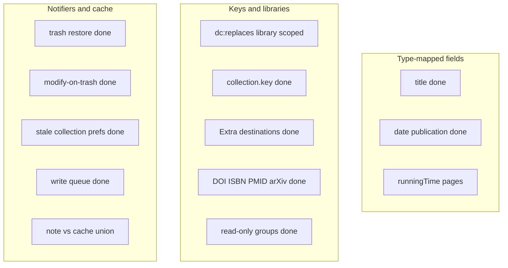

# Robustness catalog

Recent work fixed **display titles** (`getDisplayTitle`) and **item-merge remapping** (`dc:replaces`). This catalog tracks leftovers and other families that can drop assignments, show Untitled, fight Zotero sync, or break on groups / Zotero 8–10.

---

## Grounding in other plugins

These are bugs other Zotero plugins already filed and fixed. Third-wave work maps onto them:

| Category                                                 | Seen in the wild                                                                                                                                                                                                                                                                   | Our analogue                                                                                                                                                                   |
| -------------------------------------------------------- | ---------------------------------------------------------------------------------------------------------------------------------------------------------------------------------------------------------------------------------------------------------------------------------- | ------------------------------------------------------------------------------------------------------------------------------------------------------------------------------ |
| `getNote()` on a book throws in Zotero 9                 | Better BibTeX [#3541](https://github.com/retorquere/zotero-better-bibtex/issues/3541) (`getNote() can only be called on notes and attachments (… is a book)`). Fix: [947c3f4](https://github.com/retorquere/zotero-better-bibtex/commit/947c3f4c515c11a54bf00ae91f4ff5b0b07becb0). | **Done** (`1243dbd`). [readItemNote](src/utils/items.ts).                                                                                                                      |
| Sync sends `modify` for items already in the trash       | Better BibTeX [#2401](https://github.com/retorquere/zotero-better-bibtex/issues/2401), [#2676](https://github.com/retorquere/zotero-better-bibtex/issues/2676): regenerating keys on those events reinstated trash.                                                                | **Done** (`392c64a`). Extra absorb and the item notifier skip anything that is not a live [isSyllabusMemberItem](src/utils/items.ts).                                          |
| Prefs list still shows deleted collections               | Notero [#775](https://github.com/dvanoni/notero/issues/775) (fixed in 1.2.2): deleted collections lingered in sync prefs.                                                                                                                                                          | **Done** (`03c3517`). [pruneStaleCollectionPrefs](src/utils/collectionPrefs.ts) on trash/delete and index rebuild.                                                             |
| Writes fail in read-only group libraries                 | Better BibTeX [#3430](https://github.com/retorquere/zotero-better-bibtex/issues/3430), [#3469](https://github.com/retorquere/zotero-better-bibtex/issues/3469): cannot set citation keys when `library.editable` is false.                                                         | **Done** (`08c91fc`). [libraryIsEditable](src/utils/zotero.ts) gates note persist and Extra destinations.                                                                      |
| Feed items look like regular items                       | Better BibTeX skips `isFeedItem`.                                                                                                                                                                                                                                                  | **Done** (`e0e4a23`).                                                                                                                                                          |
| Identity keyed by the wrong id; My Library vs collection | Notero [#706](https://github.com/dvanoni/notero/issues/706) and related.                                                                                                                                                                                                           | **Done** (`80261b4`). Reading schedule is per library ([readingScheduleCollection.ts](src/modules/readingScheduleCollection.ts)).                                              |
| Prefs do not sync between machines                       | zotero-reading-list [#83](https://github.com/Dominic-DallOsto/zotero-reading-list/issues/83).                                                                                                                                                                                      | Gallery / view-mode prefs stay in `Zotero.Prefs`, not the collection note.                                                                                                     |
| Plugin JSON inside notes; both-sides-edited sync         | Better Notes (windingwind): [Note Synchronization](https://github.com/windingwind/zotero-better-notes/wiki/4.9-Note-Synchronization-Sycn.en) detects both-sides-edited notes and merges instead of dropping the incoming side.                                                     | **Done** (`eef4e58`). [shouldAdoptIncomingNote](src/modules/syllabusNote.ts) applies a strictly newer parseable note even while a write is in flight; reconcile after persist. |
| Capture `libraryID` at notify time                       | Zotlit (aidenlx): the item may already be gone.                                                                                                                                                                                                                                    | Merge remap already scopes by `libraryID` (`d2e065f`).                                                                                                                         |

---

## A. Type-mapped fields

Zotero only maps base fields if you pass `includeBaseMapped`: `getField(field, false, true)`. Title uses `getDisplayTitle()`.

- **Date / publication / publisher / pages** — **Done** (`bc802db`).
- `**runningTime` / page ranges** — **Done** (`30a2876`). [parseRunningTimeMinutes](src/utils/readingTime.ts), [pageCountFromPagesField](src/utils/readingTime.ts).
- **Creators** — **Done** (`182d5d4`). [getItemCreatorLine](src/utils/items.ts) uses Zotero `firstCreator` (primary type, localized) on gallery tiles and cards.
- **Letters/interviews** — untitled items get synthesized titles from `getDisplayTitle`. Import title-match can false-positive on “Letter to Smith”.

---

## B. Item and collection identity

### Merges (follow-up to `ec21c7d`)

- **Library-unscoped remap** — **Done** (`d2e065f`). [selectItemKeyRemapForDocument](src/modules/syllabusNote.ts) requires the merge library.
- Merge flash (Further reading, then jump back).
- Restore loser / Duplicate Item / copy-to-group: new or restored key, no `dc:replaces`.
- Duplicate Collection: same items, possibly a shared or copied syllabus note.
- Same item in two syllabi; 3-way merge; loser assigned and winner not yet in the collection.
- [collectionItems.ts](src/modules/react-zotero-sync/collectionItems.ts) **trash/restore** — **Done** (`07be04d`).
- **Orphan keys after plain delete** — **Done** (`cafad74`). [omitDocumentItemKeys](src/modules/syllabusNote.ts) drops assignments when `getByLibraryAndKey` no longer finds the item.

### Collection keys

- `**getAllCollections` key-only dedupe** — **Done** (`d2b9d8c`). [dedupeCollectionsByLibraryAndKey](src/utils/zotero.ts).
- **Stale collection-id prefs** — **Done** (`03c3517`). Notero [#775](https://github.com/dvanoni/notero/issues/775): deleted collections lingered in prefs. [pruneStaleCollectionPrefs](src/utils/collectionPrefs.ts) drops `collectionViewModes` / gallery maps on trash, delete, and index rebuild. Recreate-with-new-id still will not inherit the old mode (by design).

### Extra absorb

- **Last-destination-wins** — **Done** (`563c126`). [placeItemInSyllabusDestinations](src/modules/syllabusExtra.ts): one dest still moves; several dests add to each.
- **Modify-on-trash Extra absorb** — **Done** (`392c64a`). Better BibTeX [#2401](https://github.com/retorquere/zotero-better-bibtex/issues/2401) / [#2676](https://github.com/retorquere/zotero-better-bibtex/issues/2676).
- Stale Extra ref → Extra never cleared, retries forever. Connector double-POST leftovers. Absorb skipped on class folders (Extra may linger).

### Import matching (`remapDocumentItemKeys`)

DOI URL vs bare; ISBN-10 vs 13 — **Done** (`c85b039`). PMID / PMCID / arXiv (Extra, URL, archiveID) — **Done** (`8722e12`). Still open: title-only first-wins.

---

## C. Notifiers, cache, write queue (BBT / Zotlit)

- **Item cache trash/restore** — **Done** (`07be04d`). [OBJECT_LIFECYCLE_EVENTS](src/utils/cache.ts).
- **Modify when `item.deleted`** — **Done** (`392c64a`). BBT [#2401](https://github.com/retorquere/zotero-better-bibtex/issues/2401).
- BBT skips `isFeedItem`. **Done** (`e0e4a23`) via [isSyllabusMemberItem](src/utils/items.ts).
- `**getNote()` on a non-note** — **Done** (`1243dbd`). BBT [#3541](https://github.com/retorquere/zotero-better-bibtex/issues/3541). [readItemNote](src/utils/items.ts).
- **Write-inflight skip** — **Done** (`eef4e58`). Better Notes [both-sides-edited sync](https://github.com/windingwind/zotero-better-notes/wiki/4.9-Note-Synchronization-Sycn.en). [shouldAdoptIncomingNote](src/modules/syllabusNote.ts).
- **documentForWrite** — **Done** (`b57abac`). Parsed note wins; cache only if the note is unreadable.
- **enqueueWrite** nested `mutateCollectionDocument` from class-folder ensure — **Done** (`be018c4`). [createReentrantSerialQueue](src/utils/serialQueue.ts); trash path skips while a write is in flight.

---

## D. Notes as source of truth (Better Notes)

- User edits readable prose / breaks `<pre>` → fallback grabs the first `{`…`}` — **Done** (`da61cf4`); tagged pre + syllabus-shaped JSON only.
- Newer plugin writes a future `version` → older plugin refuses writes but coerce-downgrade may still parse elsewhere.
- Startup format-patch rewrite vs unsynced local edits → Zotero sync conflict.
- Large notes: rewrite whole HTML on every mutate.
- Duplicate syllabus notes in one collection (import leftovers).

---

## E. Class folders and reading schedule

Class folders: rename races, name-pattern adoption, extras erased when turning on. **255-char names** — **Done** (`9d867ed`). [classSubcollectionName](src/modules/classSubcollections.ts) clamps the final folder name.

Reading schedule: **per library** — **Done** (`80261b4`). Inverse of Notero [#706](https://github.com/dvanoni/notero/issues/706). Group syllabi get their own “Reading Schedule” tree because items cannot cross libraries.

---

## F. Groups, permissions, Zotero majors

- **Read-only group writes** — **Done** (`08c91fc`). BBT [#3430](https://github.com/retorquere/zotero-better-bibtex/issues/3430), [#3469](https://github.com/retorquere/zotero-better-bibtex/issues/3469). [libraryIsEditable](src/utils/zotero.ts).
- Joining a synced group (new keys); prefs (gallery/view mode) do not sync ([Reading List #83](https://github.com/Dominic-DallOsto/zotero-reading-list/issues/83)); Zotero 7 silent skip of schedule/translators; Reading List Extra is read-only.

---

## G. Import, translators, print, gallery, chrome

Connector ports, print HiddenBrowser, gallery keyboard, item pane vs class folder, tree icon patches, TabManager index pairing, standalone attachments.

---

## Severity

**Done (first wave):** collection key collision; library-scoped merge remap; Extra last-destination; cache/list trash; mapped dates/publication.

**Done (second wave):** DOI/ISBN import match; runningTime/pages parse; note JSON extract; documentForWrite note-wins; skip feed/deleted members.

**Done (third wave, grounded):** `getNote()` on non-notes (BBT #3541); Extra absorb on trashed modify (BBT #2401); stale collection prefs (Notero #775); read-only group writes (BBT #3430 / #3469).

**Done (follow-up):** write-inflight adopt of a newer note (Better Notes both-sides-edited, `eef4e58`); reentrant write queue (`be018c4`); reading schedule per library (Notero #706 inverse, `80261b4`).

**Done (hygiene):** orphan keys after plain delete (`cafad74`); localeCompare uses the UI locale (`559e0b1`); class-folder 255-char names (`9d867ed`); PMID/PMCID/arXiv import match (`8722e12`); creator-type display (`182d5d4`).

**Product / policy:** collapse same-class rows after merge; whether Duplicate Item should copy assignments.