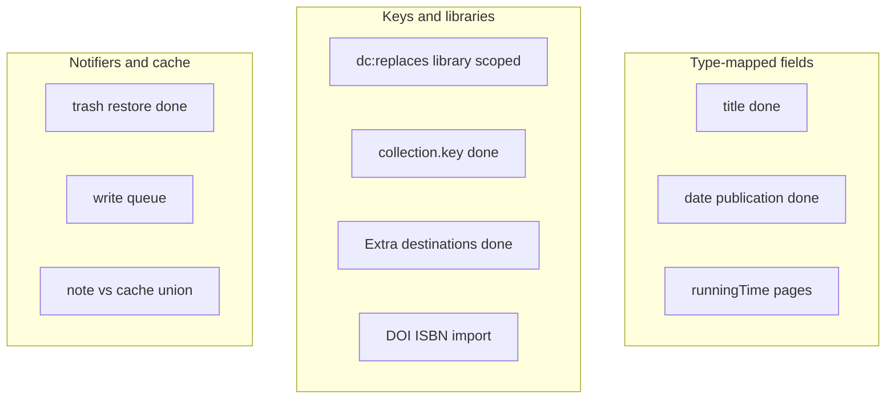

# Robustness catalog

Recent work fixed **display titles** (`getDisplayTitle`) and **item-merge remapping** (`dc:replaces`). This catalog tracks leftovers and other families that can drop assignments, show Untitled, fight Zotero sync, or break on groups / Zotero 8–10.

---

## A. Type-mapped fields

Zotero only maps base fields if you pass `includeBaseMapped`: `getField(field, false, true)`. Title uses `getDisplayTitle()`.

- **Date / publication / publisher / pages** — **Done** (`bc802db`). `getItemField` in [items.ts](src/utils/items.ts). Cases, statutes, patents, book sections covered by tests in [test/itemTitle.test.ts](test/itemTitle.test.ts).
- **`runningTime` via `parseInt`** — still turns `"1:30:00"` into `1`. Page field `"iv, 1–200"` still parses the first digits.
- **Creators** — Gallery [itemAuthorLine](src/modules/GalleryPage.tsx) prefers `author`; patents/films/interviews/podcasts disagree with cards (`firstCreator`).
- **Letters/interviews** — untitled items get synthesized titles from `getDisplayTitle`. Import title-match can false-positive on “Letter to Smith”.

---

## B. Item and collection identity

### Merges (follow-up to `ec21c7d`)

- **Library-unscoped remap** — **Done** (`d2e065f`). [selectItemKeyRemapForDocument](src/modules/syllabusNote.ts) requires the merge library.
- Merge flash (Further reading, then jump back).
- Restore loser / Duplicate Item / copy-to-group: new or restored key, no `dc:replaces`.
- Duplicate Collection: same items, possibly a shared or copied syllabus note.
- Same item in two syllabi; 3-way merge; loser assigned and winner not yet in the collection.
- [collectionItems.ts](src/modules/react-zotero-sync/collectionItems.ts) **trash/restore** — **Done** (`07be04d`).

### Collection keys

- **`getAllCollections` key-only dedupe** — **Done** (`d2b9d8c`). [dedupeCollectionsByLibraryAndKey](src/utils/zotero.ts).
- `collectionViewModes` still keyed by collection **id** (stale after recreate). Notero analogue: [#775](https://github.com/dvanoni/notero/issues/775).

### Extra absorb

- **Last-destination-wins** — **Done** (`563c126`). [placeItemInSyllabusDestinations](src/modules/syllabusExtra.ts): one dest still moves; several dests add to each.
- Stale Extra ref → Extra never cleared, retries forever. Connector double-POST leftovers. Absorb skipped on class folders (Extra may linger).

### Import matching (`remapDocumentItemKeys`)

DOI URL vs bare; ISBN-10 vs 13; no PMID/PMCID/arXiv; title-only first-wins.

---

## C. Notifiers, cache, write queue (BBT / Zotlit)

- **Item cache trash/restore** — **Done** (`07be04d`). [OBJECT_LIFECYCLE_EVENTS](src/utils/cache.ts).
- BBT ignores `modify` when `item.deleted`. Worth checking note/Extra handlers.
- BBT skips `isFeedItem`. We filter `isRegularItem()`; feeds may still sneak in.
- **Write-inflight skip** — `handleNoteChange` skips reparse while a local write is in flight.
- **documentForWrite** unions note + cache. Two devices editing different classes can resurrect deleted classes.
- **enqueueWrite** nested `mutateCollectionDocument` from class-folder ensure = deadlock.
- `getNote()` on a non-note throws in Zotero 9 (BBT [#3541](https://github.com/retorquere/zotero-better-bibtex/commit/947c3f4c515c11a54bf00ae91f4ff5b0b07becb0)).

---

## D. Notes as source of truth (Better Notes)

- User edits readable prose / breaks `<pre>` → fallback grabs the first `{`…`}` (could be a citation).
- Newer plugin writes a future `version` → older plugin refuses writes but coerce-downgrade may still parse elsewhere.
- Startup format-patch rewrite vs unsynced local edits → Zotero sync conflict.
- Large notes: rewrite whole HTML on every mutate.
- Duplicate syllabus notes in one collection (import leftovers).

---

## E. Class folders and reading schedule

Class folders: rename races, name-pattern adoption, read-only groups, extras erased when turning on.

Reading schedule: **My Library only**. Group-only syllabi never appear.

---

## F. Groups, permissions, Zotero majors

Read-only group write UI; joining a synced group (new keys); prefs (gallery/view mode) do not sync; Zotero 7 silent skip of schedule/translators; Reading List Extra is read-only.

---

## G. Import, translators, print, gallery, chrome

Connector ports, print HiddenBrowser, gallery keyboard, item pane vs class folder, tree icon patches, TabManager index pairing, prefs migration stale numeric ids, standalone attachments.

---

## Severity

**Done (first wave):** collection key collision; library-scoped merge remap; Extra last-destination; cache/list trash; mapped dates/publication.

**Still likely user-visible:**

1. `documentForWrite` resurrecting deleted classes on two-device sync
2. Nested write-queue deadlock if an ensure path regresses
3. Note HTML first-`{` extract
4. DOI/ISBN import mismatch
5. Feed items on the syllabus

**Product / policy:** reading schedule for group libraries; collapse same-class rows after merge; whether Duplicate Item should copy assignments.

**Hygiene:** orphan keys after plain delete; `runningTime` parse; localeCompare locale; class-folder 255-char names.
