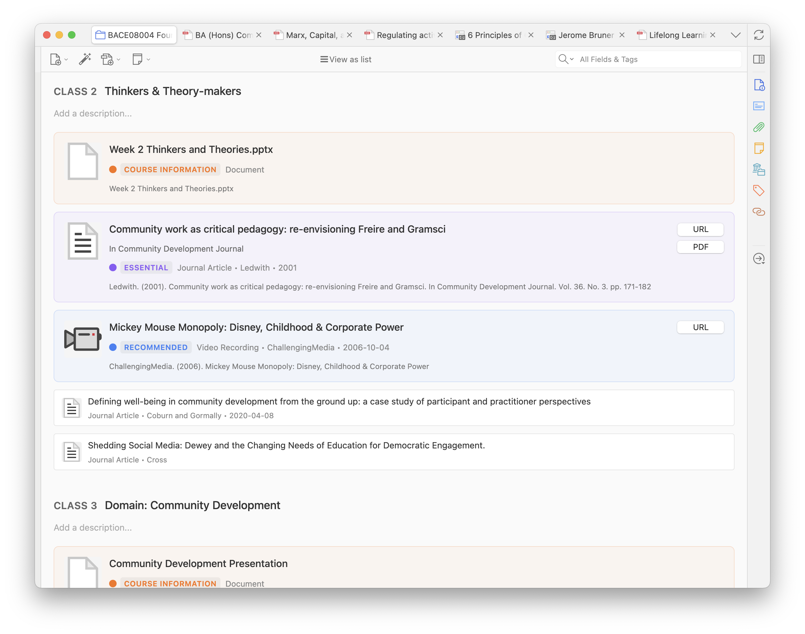
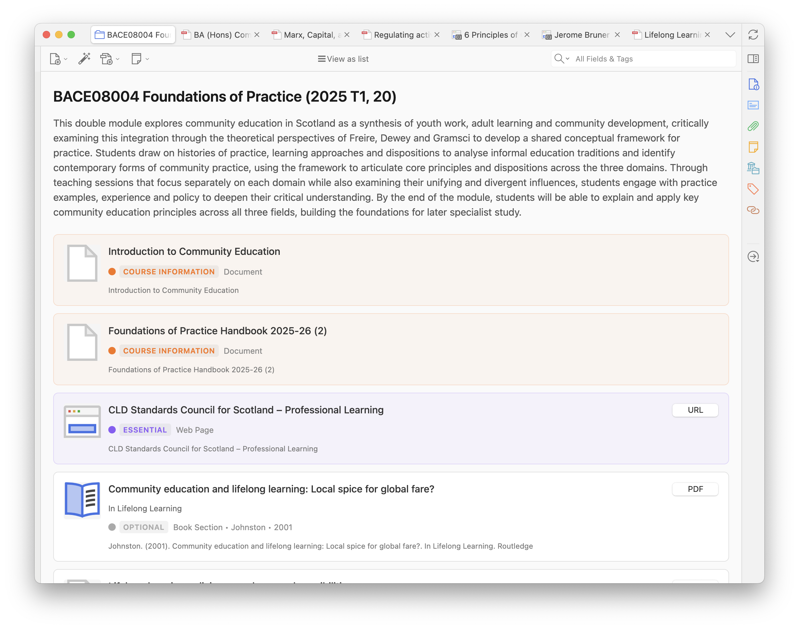
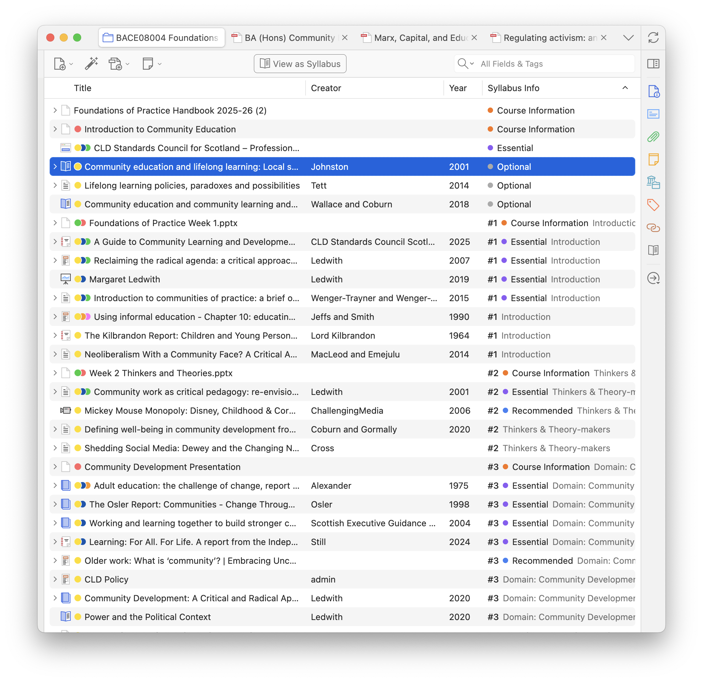
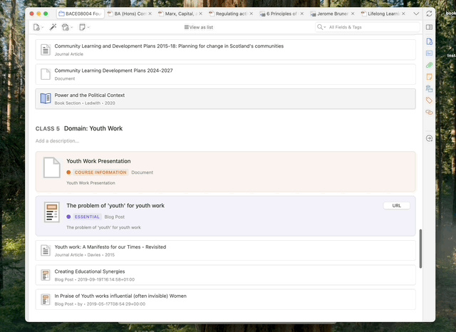
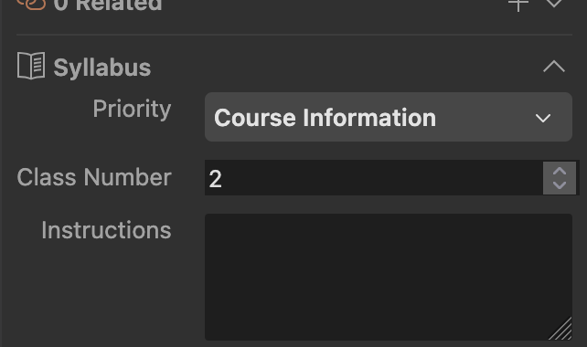
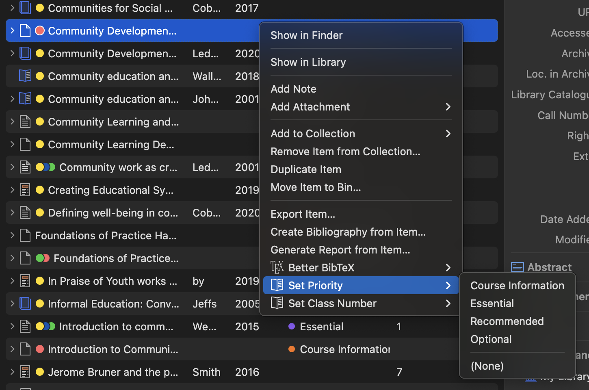

# Zotero Syllabus

[](https://www.zotero.org)

A Zotero add-on / plugin that turns your collections into syllabi and course reading lists. Order your items by class, tag things as required / optional reading and pin course information.

## Installation

1. Download the latest release from the [Releases](https://github.com/janbaykara/zotero-syllabus/releases) page.
2. In Zotero, go to `Tools` → `Add-ons`
3. Click the gear icon and select `Install Add-on From File...`
4. Select the downloaded `.xpi` file
5. (Ensure auto-updating is enabled for this add-on too.)

> [!NOTE]
> Just an FYI: styling is applied most perfectly in [Zotero 8 (beta)](https://www.zotero.org/support/beta_builds). Zotero 7 (stable release) works fine; there are just some minor styling issues.

## Discussion

- For **bug reports** and **feature requests**, please use the [GitHub Issues](https://github.com/janbaykara/zotero-syllabus/issues) page.
- For **general discussion**, please use the [Zotero Forum Thread](https://forums.zotero.org/discussion/128688/zotero-syllabus-a-plugin-for-managing-your-uni-course-reading-lists) or [Reddit Thread](https://www.reddit.com/r/zotero/comments/1puxigg/zotero_syllabus_a_plugin_for_managing_your_uni/).

## A tour of the features

### Syllabus Metadata

Items are grouped by class number, and can be given a priority. Assign classes a name and description.



Pin important course information to the top of the syllabus.



### Standard List View

The standard Zotero item list view has added columns for class numbers, instructions, and reading priority levels. There's also an 'all in one' column that shows all the syllabus metadata at once. Sorting by this column will sort by class number first, then by priority.



#### How to edit an item's syllabus metadata

Drag and drop items between classes.



Use the item pane to edit class number, instruction, and priority for an item.



Right-click an item to re-assign class number or priority.



### Other features

- **Manual item re-ordering** within a class.
- **Sortable "Syllabus Info" column** to your standard list view, to summarise all the key info. Sort by this column if you want to see what order your readings need to be done in.
- **Assign an item multiple times** within a syllabus. Useful for breaking down larger readings into smaller chunks.
- **Compact view mode** for when you'd like to see a bit more all at once.
- **Zotero Reading List compatibility**: if you have the [Zotero Reading List](https://github.com/Dominic-DallOsto/zotero-reading-list) plugin installed, reading status will be displayed in the syllabus view
- **Print to PDF** — as of right now it gives you a printable HTML page as a file, which you can open in a browser and print to PDF.

## Development

This plugin is built using the [Zotero Plugin Template](https://github.com/windingwind/zotero-plugin-template).

Here's how I've thought about the plugin's data model:

- 'Syllabi' are organised representations of a collection. Syllabi must mirror the items of a collection. If it's not in the collection, it's not in the syllabus.
- Syllabi have 'classes', which represent the different sections of the syllabus. Since they aren't items, and apply to multiple items, they are stored in the plugin's preferences, not the items themselves.
- Classes are made up of groups of 1+ 'assignments'. Assignments are the items that are assigned to a class, plus instructions and priorities.
- Since assignments relate strongly to items, they are stored in the items' extra fields themselves.

### Contributing

Contributions are welcome! Please feel free to submit a Pull Request.

### Requirements

- Zotero 7 beta or later
- Node.js (LTS version)
- Git
- pnpm

### Setup

1. Clone the repository:

   ```bash
   git clone https://github.com/janbaykara/zotero-syllabus.git
   cd zotero-syllabus
   ```

2. Install dependencies:

   ```bash
   pnpm install
   ```

3. Configure environment:

   ```bash
   cp .env.example .env
   # Edit .env with your Zotero installation path
   ```

4. Start development:
   ```bash
   pnpm start
   ```

### Build

Build the plugin for production:

```bash
pnpm run build
```

### Release

Create a new release:

```bash
pnpm run release
```

This will build the plugin, create the .xpi file, and prepare it for distribution.

### Testing

Run the test suite:

```bash
pnpm test
```

### Code Quality

Check code quality:

```bash
pnpm run lint:check
```

Fix code quality issues:

```bash
pnpm run lint:fix
```

### Project Structure

```
src/
├── addon.ts              # Main addon class
├── hooks.ts              # Lifecycle hooks
├── index.ts              # Entry point
├── modules/
│   ├── syllabus.ts       # Core syllabus functionality
│   └── preferenceScript.ts # Preferences handling
└── utils/
    ├── locale.ts         # Localization utilities
    ├── prefs.ts          # Preferences management
    ├── syllabus.ts       # Syllabus data utilities
    ├── window.ts         # Window management
    └── ztoolkit.ts       # Zotero toolkit setup

addon/
├── manifest.json         # Plugin manifest
├── bootstrap.js          # Bootstrap script
├── prefs.js              # Preferences defaults
├── content/              # UI content
└── locale/               # Localization files
```
