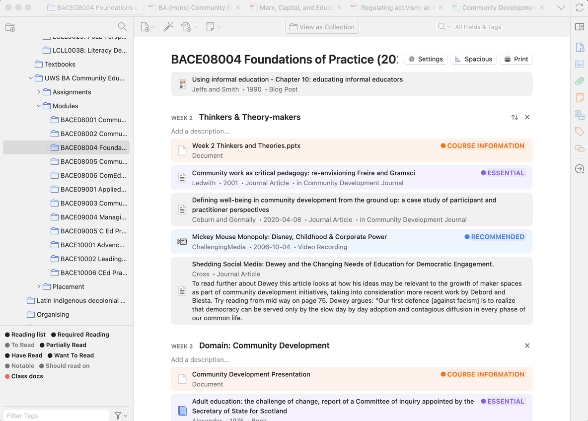
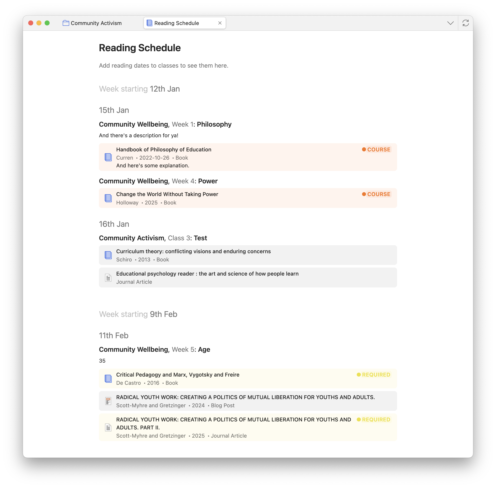
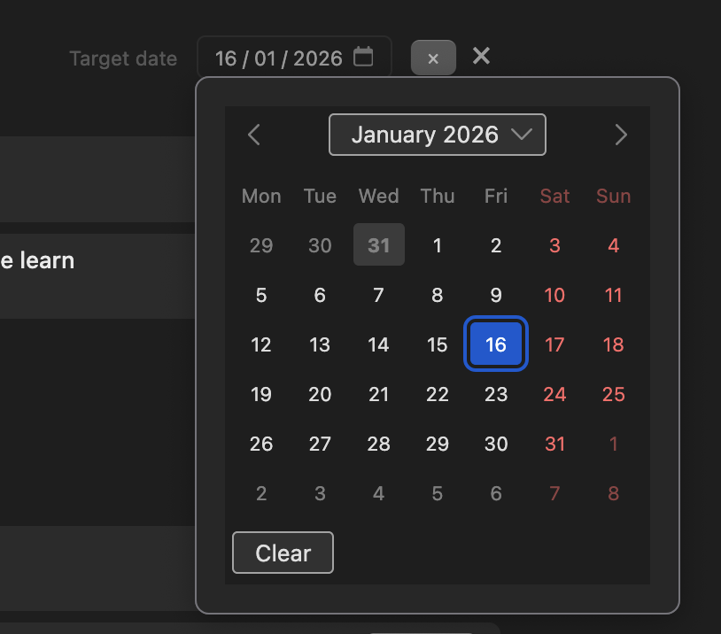
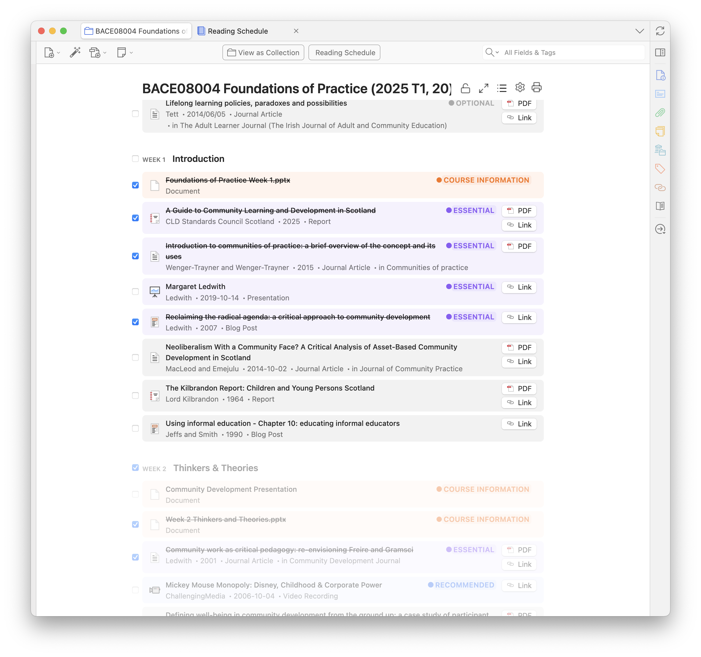

# Zotero Syllabus

[](https://www.zotero.org)

A Zotero add-on / plugin that turns your collections into syllabi and course reading lists. Order your items by class, tag things as required / optional reading and pin course information.





## How to install

1. [Download the extension file (.xpi)](https://github.com/janbaykara/zotero-syllabus/releases/latest/download/zotero-syllabus.xpi).
2. In the Zotero menu bar, go to `Tools` → `Plugins` (or `Add-ons`)
3. Click the gear icon in the top right corner and select `Install Plugin From File...`
4. Select the downloaded `.xpi` file
5. (Ensure auto-updating is enabled for this add-on too!)
6. Restart Zotero!

> [!NOTE]
> Just an FYI: for best results, use [Zotero 8 (beta)](https://www.zotero.org/support/beta_builds). Zotero 7 (stable release) works fine but has some minor styling issues.

## Discussion

- For **bug reports** and **feature requests**, please use the [GitHub Issues](https://github.com/janbaykara/zotero-syllabus/issues) page.
- For **general discussion**, please use the [Zotero Forum Thread](https://forums.zotero.org/discussion/128688/zotero-syllabus-a-plugin-for-managing-your-uni-course-reading-lists) or [Reddit Thread](https://www.reddit.com/r/zotero/comments/1puxigg/zotero_syllabus_a_plugin_for_managing_your_uni/).

## Show your thanks by donating 🙏🇵🇸🕊️

If this project is useful to you, [Buy Me a Coffee](https://buymeacoffee.com/janbaykara) and I will regularly donate proceeds to third party funds, including those that help keep **Gaza's universities, students, and academic life alive** during reconstruction, following the genocide of the Palestinian people by the Israeli-American occupation:

- **ISNAD — Emergency Fund for Gaza’s Universities (via Taawon / Welfare Association)**  
  Primary Palestinian-led programme supporting scholarships, staff, and core university operations.  
  https://taawon.org/en/isnad

- **BRISMES Fund for Higher Education in Gaza**  
  A UK academic-society fund that channels small donations in line with the priorities of Gaza’s Emergency Committee of Universities.  
  https://www.gofundme.com/f/brismes-fund-for-higher-education-in-gaza

- **Friends of Palestinian Universities (FoPU / Fobzu)**  
  Long-standing UK charity supporting Palestinian universities, including emergency work for Gaza.  
  https://fobzu.org

- **BuildPalestine — Gaza Education & Community Projects**  
  Palestinian-run crowdfunding platform that vets and supports grassroots education initiatives.  
  https://buildpalestine.com

Supporting these funds helps sustain students, staff, research, and educational infrastructure — the foundations for rebuilding Gaza’s higher-education system.

_Thank you for contributing in solidarity._

## A tour of the features

### Add assignments to classes

Items are grouped by class number, and can be given a priority. Assign classes a name and description. Customize the terminology (e.g., "week", "class", "session", "section") and define custom priority levels with your own names and colors.


### Course documents

Pin important course information to the top of the syllabus.


### Order your items in list view

A **sortable "Syllabus Info" column** to your standard list view, to summarise all the key info. Sort by this column if you want to see what order your readings need to be done in.


#### Manually reorder items within a class


Drag and drop items to reorder them within a class, or reset to natural order.

#### Move items between classes

Drag and drop items between classes.


#### Add reading instructions to assignments

Use the item pane to edit class number, instruction, and priority for an item.


#### Quickly re-assign class number or priority

Right-click an item to re-assign class number or priority.


#### Set a due date for a class



#### Review your reading schedule across all classes


#### And keep track of what you've read already



### Other features

- **Assign an item multiple times** within a syllabus. Useful for breaking down larger readings into smaller chunks.
- **Print to PDF** — as of right now it gives you a printable HTML page as a file, which you can open in a browser and print to PDF.
- **Zotero Reading List compatibility**: if you have the [Zotero Reading List](https://github.com/Dominic-DallOsto/zotero-reading-list) plugin installed, reading status will be displayed in the syllabus view
- **Customizable priorities** — Define your own priority levels with custom names and colors, or use the defaults (Essential, Recommended, Optional, Course Information).
- **Customizable nomenclature** — Change the terminology used throughout (e.g., "week", "class", "session", "section") with automatic pluralization.

## Development

This plugin is built using the [Zotero Plugin Template](https://github.com/windingwind/zotero-plugin-template).

Here's how I've thought about the plugin's data model:

- 'Syllabi' are organised representations of a collection. Syllabi must mirror the items of a collection. If it's not in the collection, it's not in the syllabus.
- Syllabi have 'classes', which represent the different sections of the syllabus. Since they aren't items, and apply to multiple items, they are stored in the plugin's preferences, not the items themselves.
- Classes are made up of groups of 1+ 'assignments'. Assignments are the items that are assigned to a class, plus instructions and priorities.
- Since assignments relate strongly to items, they are stored in the items' extra fields themselves.

### Contributing

Contributions are welcome! Please feel free to submit a Pull Request.

### Requirements

- Zotero 7 beta or later
- Node.js (LTS version)
- Git
- pnpm

### Setup

1. Clone the repository:

   ```bash
   git clone https://github.com/janbaykara/zotero-syllabus.git
   cd zotero-syllabus
   ```

2. Install dependencies:

   ```bash
   pnpm install
   ```

3. Configure environment:

   ```bash
   cp .env.example .env
   # Edit .env with your Zotero installation path
   ```

4. Start development:
   ```bash
   pnpm start
   ```

### Build

Build the plugin for production:

```bash
pnpm run build
```

### Release

Create a new release:

```bash
pnpm run release
```

This will build the plugin, create the .xpi file, and prepare it for distribution.

### Testing

Run the test suite:

```bash
pnpm test
```

### Code Quality

Check code quality:

```bash
pnpm run lint:check
```

Fix code quality issues:

```bash
pnpm run lint:fix
```

### Project Structure

```
src/
├── addon.ts              # Main addon class
├── hooks.ts              # Lifecycle hooks
├── index.ts              # Entry point
├── modules/
│   ├── syllabus.ts       # Core syllabus functionality
│   └── preferenceScript.ts # Preferences handling
└── utils/
    ├── locale.ts         # Localization utilities
    ├── prefs.ts          # Preferences management
    ├── syllabus.ts       # Syllabus data utilities
    ├── window.ts         # Window management
    └── ztoolkit.ts       # Zotero toolkit setup

addon/
├── manifest.json         # Plugin manifest
├── bootstrap.js          # Bootstrap script
├── prefs.js              # Preferences defaults
├── content/              # UI content
└── locale/               # Localization files
```

### Technical references

- `zotero-plugin-toolkit`
  - README: https://github.com/windingwind/zotero-plugin-toolkit
  - Docs: https://windingwind.github.io/zotero-plugin-toolkit/
- Zotero 7 plugin development guide: https://gist.github.com/EwoutH/04c8df5a97963b5b46cec9f392ceb103#file-zotero_7_plugin_dev_guide-md
- Zotero 7 plugin technical notes: https://www.zotero.org/support/dev/zotero_7_for_developers#plugin_changes
