# Zotero Syllabus

A Zotero add-on / plugin that turns your collections into syllabi and course reading lists. Order your items by class, tag things as required / optional reading and pin course information.

Changing the plugin? Architecture, storage, and local development are in **[doc/TECHNICAL.md](doc/TECHNICAL.md)**.

## How to install

1. [Download the extension file (.xpi)](https://github.com/janbaykara/zotero-syllabus/releases/latest/download/zotero-syllabus.xpi).
2. In the Zotero menu bar, go to `Tools` → `Plugins` (or `Add-ons`)
3. Click the gear icon in the top right corner and select `Install Plugin From File...`
4. Select the downloaded `.xpi` file
5. (Ensure auto-updating is enabled for this add-on too!)
6. Restart Zotero!

> [!NOTE]
> For best results, use [Zotero 8, 9, or 10](https://www.zotero.org/download/). Zotero 7 works but has some minor styling issues.

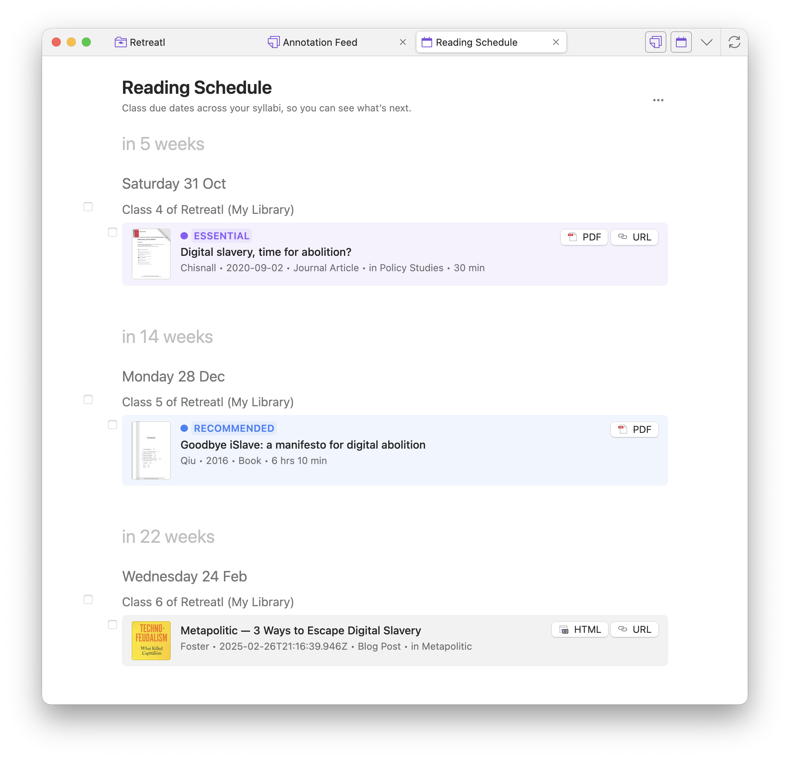

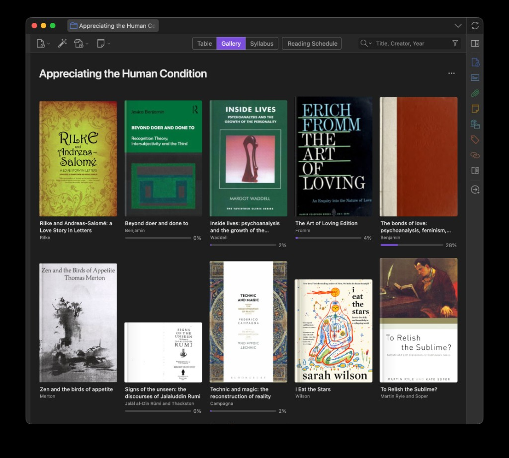

## Can YOU spare 15 minutes to tell me how you're using the tool?

A message from Jan, the software developer:

> Hey all! According to Github over 350+ people have downloaded the extension so far. Great!
>
> To help improve the plugin for students, would you be up for a quick 15 min Zoom call? ([Here's the booking link.](https://calendly.com/janbaykara-pm/30min)) We'd talk through how you're using the tool, how you found getting started, and what could be improved to improve studying with Zotero.
>
> I'm particularly interested to improve the onboarding / documentation / accessibility of the tool, but your thoughts might also help shape new features! I'll be listening as a software developer, as a fellow student, and as student of pedagogy in particular!
>
> If you can spare 15 minutes, here's a booking link: https://calendly.com/janbaykara-pm/30min - Pick a slot and I look forward to chatting!
>
> — Jan :)

## Discussion

- For **bug reports** and **feature requests**, please use the [GitHub Issues](https://github.com/janbaykara/zotero-syllabus/issues) page.
- For **general discussion**, please use the [Zotero Forum Thread](https://forums.zotero.org/discussion/128688/zotero-syllabus-a-plugin-for-managing-your-uni-course-reading-lists) or [Reddit Thread](https://www.reddit.com/r/zotero/comments/1puxigg/zotero_syllabus_a_plugin_for_managing_your_uni/).

## Show your thanks by donating 🙏🇵🇸🕊️

If this project is useful to you, [Buy Me a Coffee](https://buymeacoffee.com/janbaykara) and I will regularly donate proceeds to third party funds, including those that help keep **Gaza's universities, students, and academic life alive** during reconstruction, following the genocide of the Palestinian people by the Israeli-American occupation:

- **ISNAD — Emergency Fund for Gaza’s Universities (via Taawon / Welfare Association)**  
  Primary Palestinian-led programme supporting scholarships, staff, and core university operations.  
  https://taawon.org/en/isnad

- **BRISMES Fund for Higher Education in Gaza**  
  A UK academic-society fund that channels small donations in line with the priorities of Gaza’s Emergency Committee of Universities.  
  https://www.gofundme.com/f/brismes-fund-for-higher-education-in-gaza

- **Friends of Palestinian Universities (FoPU / Fobzu)**  
  Long-standing UK charity supporting Palestinian universities, including emergency work for Gaza.  
  https://fobzu.org

- **BuildPalestine — Gaza Education & Community Projects**  
  Palestinian-run crowdfunding platform that vets and supports grassroots education initiatives.  
  https://buildpalestine.com

Supporting these funds helps sustain students, staff, research, and educational infrastructure — the foundations for rebuilding Gaza’s higher-education system.

_Thank you for contributing in solidarity._

## A tour of the features

### Add assignments to classes

Items are grouped by class number, and can be given a priority. Assign classes a name and description. Customize the terminology (e.g., "week", "class", "session", "section") and define custom priority levels with your own names and colors.

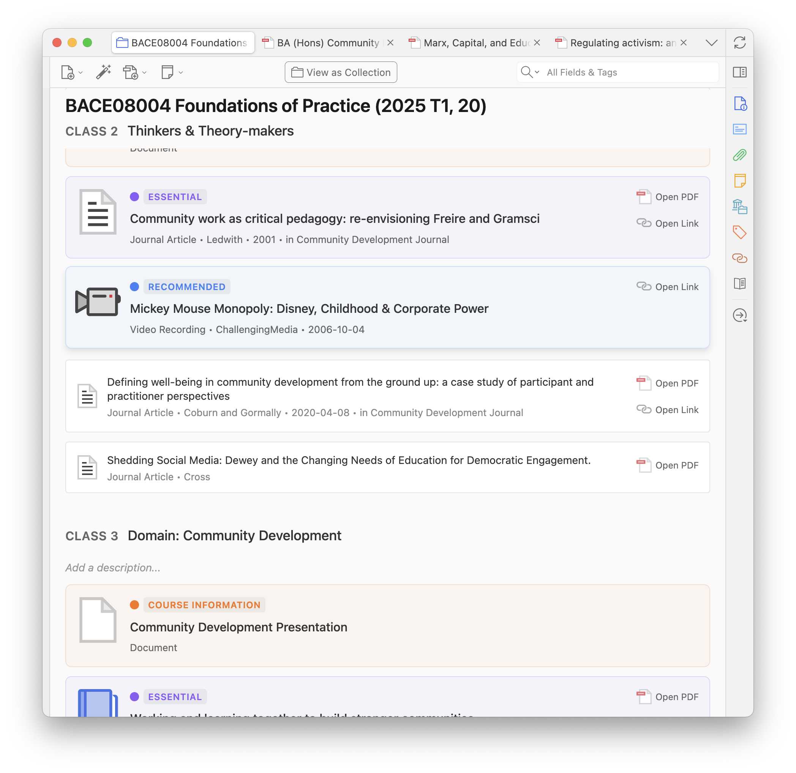

#### How can I assign an item to a class?

1. First, select the collection where the classes will live.
2. Then you'll need to add some classes. You can do this by...

- Clicking "View As Syllabus" and then clicking the "Add Class" button.
- Right-clicking an item within a collection, then selecting "Assign to class" -> "Add to new class".

3. Once you've added some classes, you can assign an item to a class by...

- Right-clicking an item within a collection, then selecting "Assign to class" and then picking the class
- Clicking "View As Syllabus", then dragging the item to the class.

An item can be assigned multiple times to different classes. In "View As Syllabus", you'll find a "duplicate" button when you hover over an item.

If you merge duplicate items in Zotero, the surviving item keeps its class assignment. You do not need to reassign it.

### Course documents

Pin important course information to the top of the syllabus.

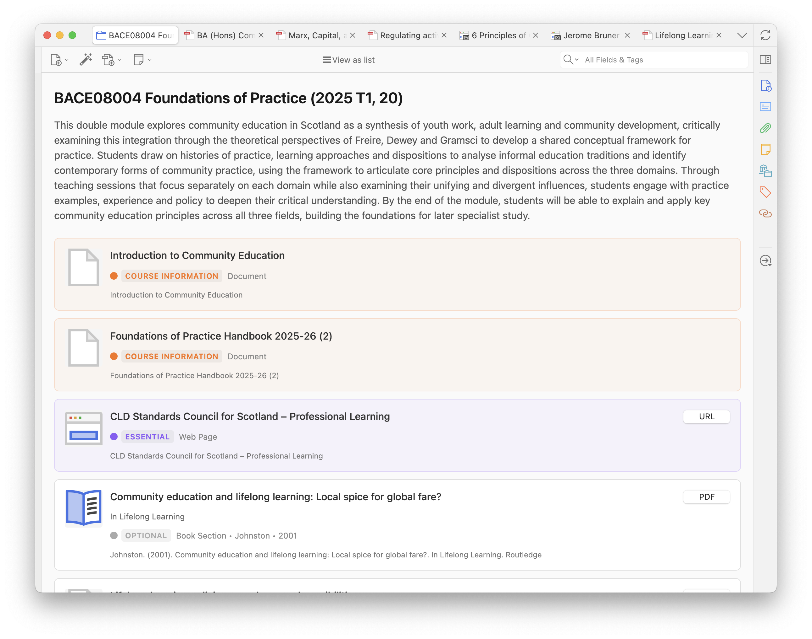

### Order your items in list view

A **sortable "Syllabus Info" column** to your standard list view, to summarise all the key info. Sort by this column if you want to see what order your readings need to be done in.

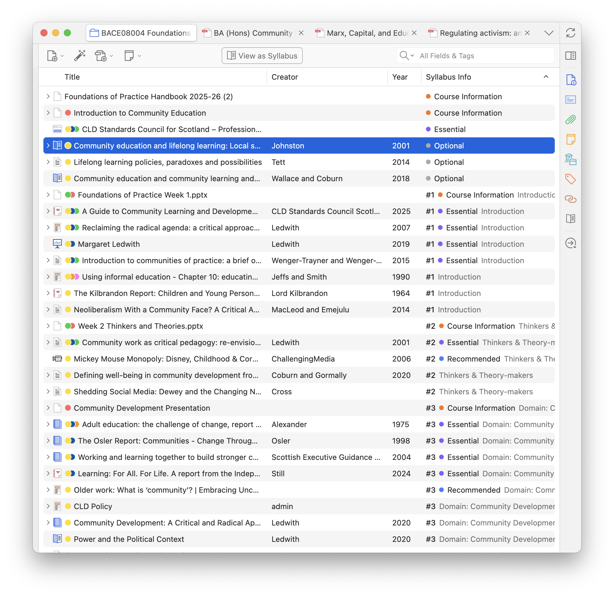

#### Manually reorder items within a class

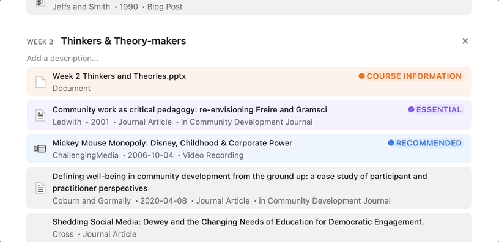

Drag and drop items to reorder them within a class, or reset to natural order.

#### Move items between classes

Drag and drop items between classes.

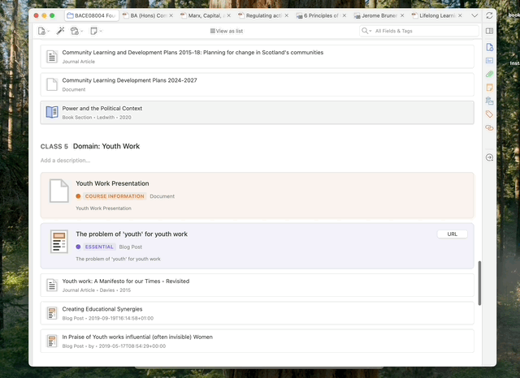

#### Add reading instructions to assignments

Use the item pane to edit class number, instruction, and priority for an item.

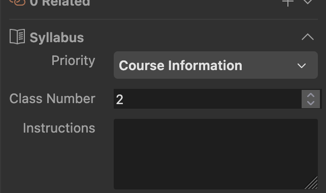

#### Quickly re-assign class number or priority

Right-click an item to re-assign class number or priority.

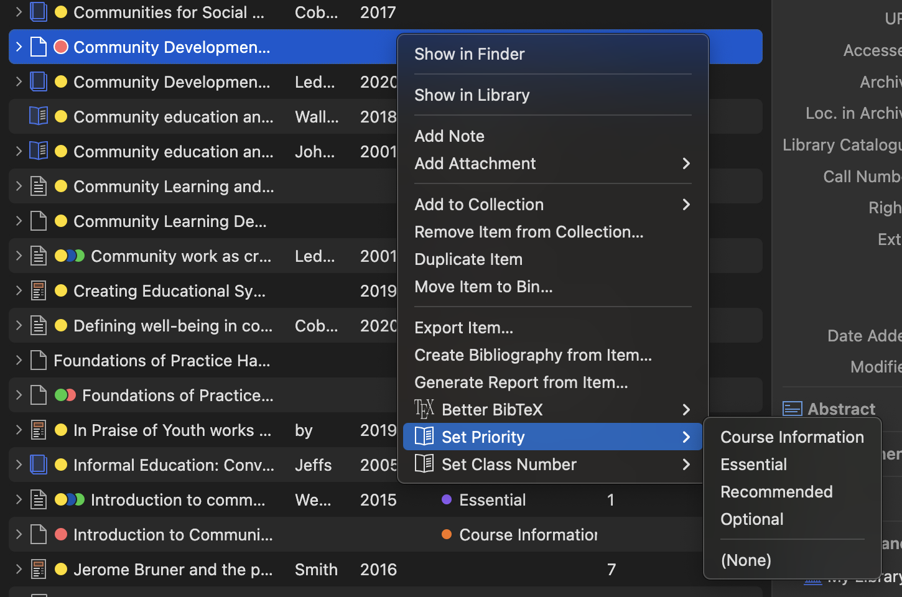

#### Set a due date for a class

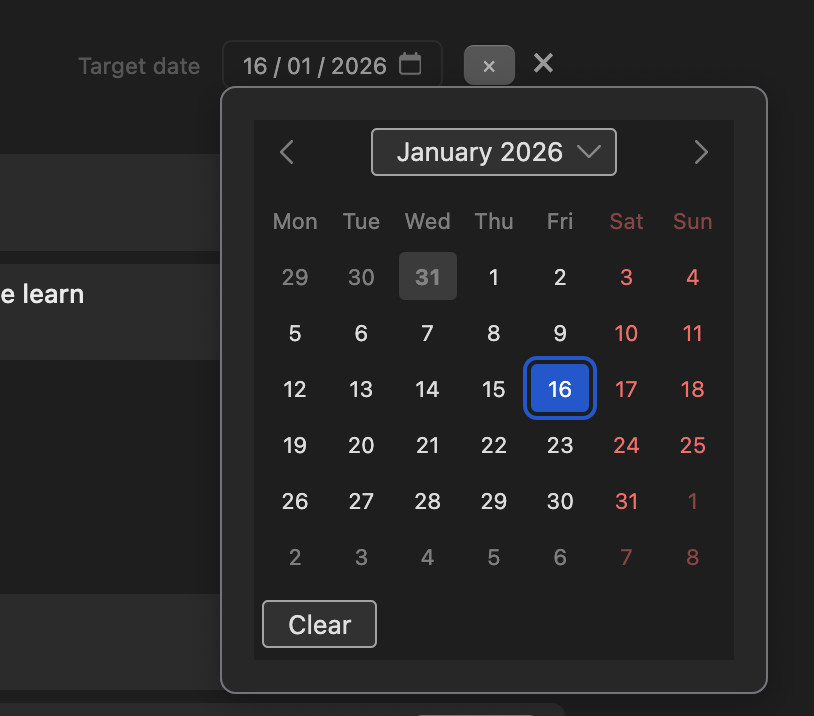

#### Review your reading schedule across all classes

#### And keep track of what you've read already

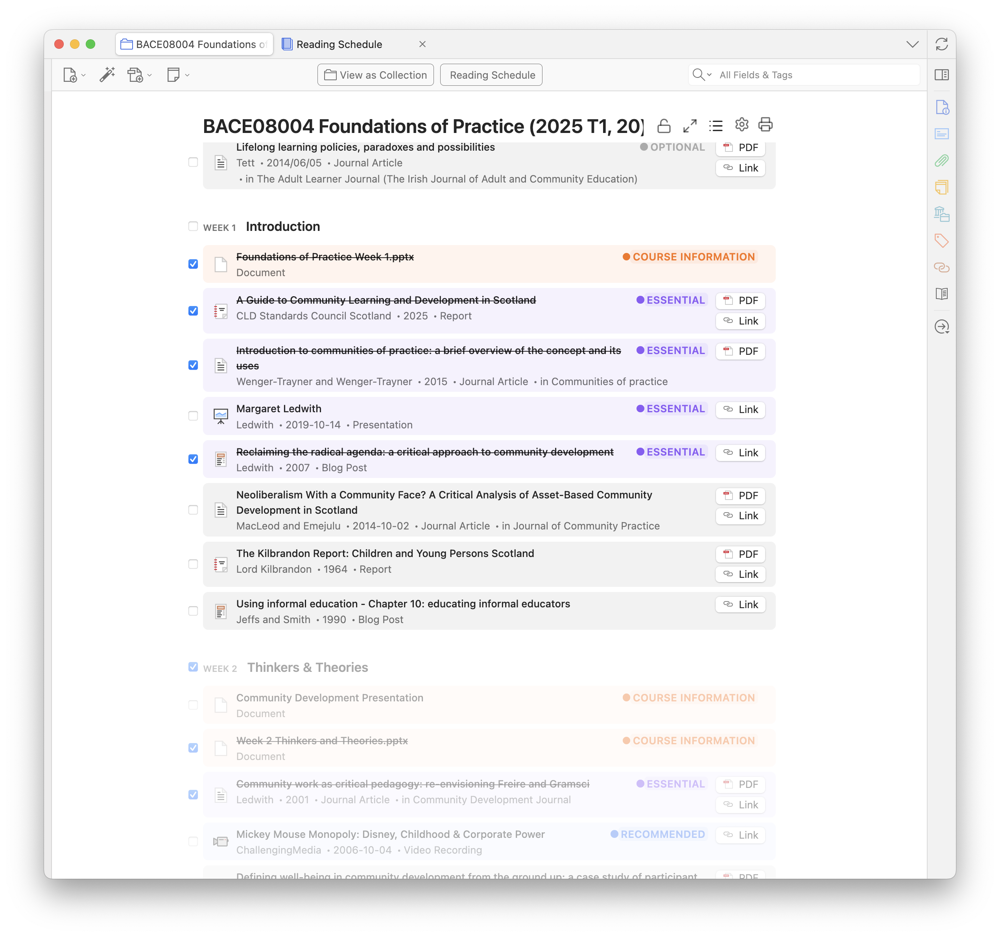

### Gallery view

Browse a collection as a cover grid. Switch with the **Table / Gallery / Syllabus** control in the items toolbar (managed collections use **Checklist** instead of Syllabus).

Covers come from attached images, EPUB/PDF art, ISBN lookups, or type-specific placeholders. Reading progress shows under each item when available. Use the ⋯ menu to change layout, sort, and grouping (type, tags, subcollections, or classes on a syllabus). If Zotero’s **Show Items from Subcollections** is on, Gallery includes those items too.

### Import a reading list

With the [Zotero Connector](https://www.zotero.org/download/connectors) installed, you can save a supported institutional reading list from the browser. The plugin creates a **new top-level collection** named after the list, turns sections into classes, and maps importance tags (essential / required / recommended / optional, and similar labels) onto syllabus priorities. While saving, it tries each View online / file link in your signed-in browser session and stores any PDFs or EPUBs it can actually download. Remaining items are then looked up the same way **Find Available PDFs** does.

This needs **Zotero 8 or later**. You must already be able to view the list in the browser (including SSO-gated lists). After you save, switch the new collection to **View as Syllabus**.

How to import:

1. Install this plugin and the Zotero Connector (Chrome, Firefox, or Edge).
2. Open a supported list in the browser and wait until the readings are visible.
3. Click the Connector button and save the page (choose all items if prompted).
4. In Zotero, open the new top-level collection and switch to syllabus view.

#### Try it without an LMS login

These are live public/guest lists last checked in August 2026 — institutions can unpublish them at any time. You must already be able to view the list in the browser. With the Connector and this plugin installed, open a list and save it.

| Platform               | Test list                                                                                                                                                                                                                                                                                                                                         |
| ---------------------- | ------------------------------------------------------------------------------------------------------------------------------------------------------------------------------------------------------------------------------------------------------------------------------------------------------------------------------------------------- |
| Talis Aspire           | [CPAS0167: Teacher as Author (UCL)](https://rl.talis.com/3/ucl/lists/38afa403-9ebf-4dbe-86b0-a80e564f9777.html)                                                                                                                                                                                                                                   |
| Leganto                | [PI3084: Research Methods in Politics and International Relations (Aberdeen)](https://abdn.leganto.exlibrisgroup.com/leganto/nui/lists/13848239600005941)                                                                                                                                                                                         |
| KeyLinks               | [MDX1234 Example Reading List](https://mdx.keylinks.org/new-ui/hierarchy/list/8875)                                                                                                                                                                                                                                                               |
| eReserve Plus          | [MHC6100 Blueprint (Edith Cowan)](https://ereserve.ecu.edu.au/app/public_lists#/unit/4955/list/15619)                                                                                                                                                                                                                                             |
| BLUEcloud Course Lists | No public student permalink found. Lists are almost always embedded in Canvas, Blackboard, or Moodle via LTI. Open a Course Lists **student view** in an LMS you have access to — the URL typically contains `courselists`, `bccl`, or `bluecloudlists`. Product overview: [CloudSource Course Lists](https://www.cloudsource.net/course-lists/). |

eReserve Plus file download is most reliable from the signed-in LMS/student reading-list view (not only the public Vue page). Leganto’s public catalogue is also a useful entry point: [Aberdeen Find Lists](https://abdn.leganto.exlibrisgroup.com/leganto/public/44ABE_INST/searchlists).

#### Supported platforms

| Platform                                                                                                    | When Connector save works                                                                                                    | Notes                                                                                                                                                                               |
| ----------------------------------------------------------------------------------------------------------- | ---------------------------------------------------------------------------------------------------------------------------- | ----------------------------------------------------------------------------------------------------------------------------------------------------------------------------------- |
| **[Talis Aspire](https://www.talis.com)**                                                                   | List pages on `rl.talis.com` (and a few institutional Talis hosts such as Lincoln and Surrey) whose URL contains `/lists/`   | Public lists work without login. Single-item `/items/` pages can also be saved.                                                                                                     |
| **[Ex Libris Leganto](https://exlibrisgroup.com/products/leganto-reading-list-management-system/)**         | Pages under `/leganto/` or `*.leganto.exlibrisgroup.com`, typically `/leganto/nui/lists/{id}`                                | Guest-published lists can be saved without signing in. Institution SSO is required when the list is not shared with “Anyone”.                                                       |
| **[KeyLinks](https://kortext.com/keylinks/)**                                                               | `*.keylinks.org` list URLs (`/list/{id}` or `/new-ui/hierarchy/list/{id}`)                                                   | Uses the list JSON API. CLA / digitised files and full-text links are downloaded when your browser session can fetch them. Notes are skipped.                                       |
| **[eReserve Plus](https://www.ereserve.com.au/)**                                                           | `ereserve` hosts, `/app/public_lists`, or an LMS LTI reading-list launch                                                     | Full import (including files) is most reliable from the **signed-in** student / LMS reading-list view. Public list pages are still useful for browsing and for Connector detection. |
| **[BLUEcloud Course Lists](https://www.sirsidynix.com/bluecloud-course-lists/)** (SirsiDynix / CloudSource) | Student-view pages whose URL contains `courselists`, `bccl`, or `bluecloudlists`, or whose title is “BLUEcloud Course Lists” | Almost always embedded in Canvas, Blackboard, or Moodle via LTI. Open the list from the LMS; there is no widely published public permalink.                                         |

### Other features

- **Assign an item multiple times** within a syllabus. Useful for breaking down larger readings into smaller chunks.
- **Print to PDF** — the printer icon asks where to save a PDF of the syllabus, including a bibliography.
- **Zotero Reading List compatibility**: if you have the [Zotero Reading List](https://github.com/Dominic-DallOsto/zotero-reading-list) plugin installed, reading status will be displayed in the syllabus view
- **Customizable priorities** — Define your own priority levels with custom names and colors, or use the defaults (Essential, Recommended, Optional, Course Information).
- **Customizable nomenclature** — Change the terminology used throughout (e.g., "week", "class", "session", "section") with automatic pluralization.

## Development

Contributions are welcome — please open a Pull Request.

How the plugin stores syllabi, handles item merges, class folders, reading-list translators, and the rest of the architecture is in **[doc/TECHNICAL.md](doc/TECHNICAL.md)**. That file also has build, test, lint, and release commands.

To run locally: clone the repo, `pnpm install`, copy `.env.example` to `.env` (set your Zotero path), then `pnpm start`. Requires Zotero 7+ (8–10 recommended), Node.js LTS, Git, and pnpm.

This plugin is built using the [Zotero Plugin Template](https://github.com/windingwind/zotero-plugin-template).

## Acknowledgements

Thanks to the following:

- The authors of all syllabi everywhere — [Teacher As Author](https://rl.talis.com/3/ucl/lists/38afa403-9ebf-4dbe-86b0-a80e564f9777.html) — including the project author's own lecturers (Community Education faculty at UWS; the Politics department at SOAS), and those who teach outside formal academic institutions.
- Academic institutions for sharing their syllabi, and platforms such as [Talis](https://www.talis.com), [Ex Libris Leganto](https://exlibrisgroup.com/products/leganto-reading-list-management-system/), [KeyLinks](https://kortext.com/keylinks/), [eReserve Plus](https://www.ereserve.com.au/), and [BLUEcloud Course Lists](https://www.sirsidynix.com/bluecloud-course-lists/) that make it possible to download this data easily.
- The [RIS](<https://en.wikipedia.org/wiki/RIS_(file_format)>) (Research Information Systems) format, which makes bibliographic records portable between tools.
- [Zotero](https://www.zotero.org)'s developers, for building an open platform, and for recent developments that have opened plugin development to contemporary web technologies.
- The Zotero plugin toolkit community, including [zotero-plugin-template](https://github.com/windingwind/zotero-plugin-template) and [zotero-plugin-toolkit](https://github.com/windingwind/zotero-plugin-toolkit).
- The authors of the open-source libraries this plugin relies on, among them [Preact](https://preactjs.com), [React](https://react.dev), [Zod](https://zod.dev), [Tailwind CSS](https://tailwindcss.com), and [esbuild](https://esbuild.github.io).
- Early users, for a steer and encouraging words.

Changing the plugin? See **[doc/TECHNICAL.md](doc/TECHNICAL.md)**.
