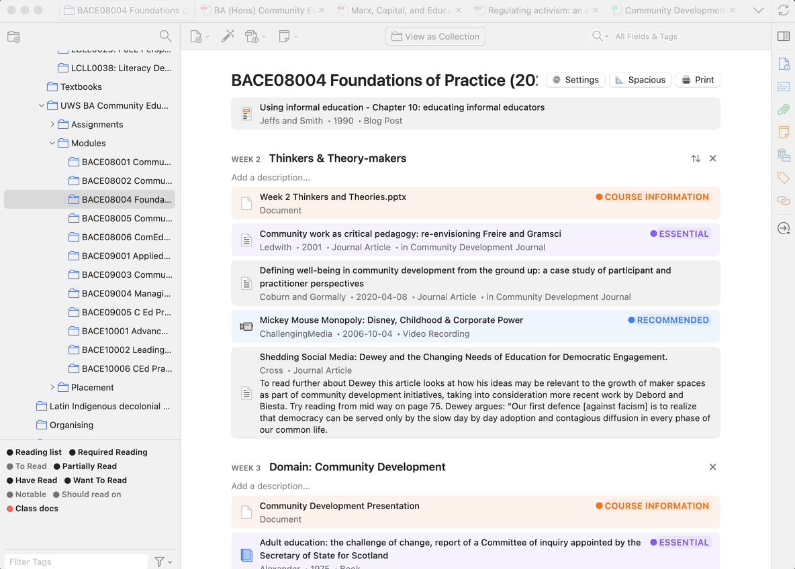

# Zotero Syllabus

[](https://www.zotero.org)

A Zotero add-on / plugin that turns your collections into syllabi and course reading lists. Order your items by class, tag things as required / optional reading and pin course information.




## How to install

1. [Download the extension file (.xpi)](https://github.com/janbaykara/zotero-syllabus/releases/latest/download/zotero-syllabus.xpi).
2. In the Zotero menu bar, go to `Tools` → `Plugins` (or `Add-ons`)
3. Click the gear icon in the top right corner and select `Install Plugin From File...`
4. Select the downloaded `.xpi` file
5. (Ensure auto-updating is enabled for this add-on too!)
6. Restart Zotero!

> [!NOTE]
> For best results, use [Zotero 8, 9, or 10](https://www.zotero.org/download/). Zotero 7 works but has some minor styling issues.

## Can YOU spare 15 minutes to tell me how you're using the tool?

A message from Jan, the software developer:

> Hey all! According to Github over 350+ people have downloaded the extension so far. Great!
>
> To help improve the plugin for students, would you be up for a quick 15 min Zoom call? ([Here's the booking link.](https://calendly.com/janbaykara-pm/30min)) We'd talk through how you're using the tool, how you found getting started, and what could be improved to improve studying with Zotero.
>
> I'm particularly interested to improve the onboarding / documentation / accessibility of the tool, but your thoughts might also help shape new features! I'll be listening as a software developer, as a fellow student, and as student of pedagogy in particular!
>
> If you can spare 15 minutes, here's a booking link: https://calendly.com/janbaykara-pm/30min - Pick a slot and I look forward to chatting!
>
> — Jan :)

## Discussion

- For **bug reports** and **feature requests**, please use the [GitHub Issues](https://github.com/janbaykara/zotero-syllabus/issues) page.
- For **general discussion**, please use the [Zotero Forum Thread](https://forums.zotero.org/discussion/128688/zotero-syllabus-a-plugin-for-managing-your-uni-course-reading-lists) or [Reddit Thread](https://www.reddit.com/r/zotero/comments/1puxigg/zotero_syllabus_a_plugin_for_managing_your_uni/).

## Show your thanks by donating 🙏🇵🇸🕊️

If this project is useful to you, [Buy Me a Coffee](https://buymeacoffee.com/janbaykara) and I will regularly donate proceeds to third party funds, including those that help keep **Gaza's universities, students, and academic life alive** during reconstruction, following the genocide of the Palestinian people by the Israeli-American occupation:

- **ISNAD — Emergency Fund for Gaza’s Universities (via Taawon / Welfare Association)**  
  Primary Palestinian-led programme supporting scholarships, staff, and core university operations.  
  https://taawon.org/en/isnad

- **BRISMES Fund for Higher Education in Gaza**  
  A UK academic-society fund that channels small donations in line with the priorities of Gaza’s Emergency Committee of Universities.  
  https://www.gofundme.com/f/brismes-fund-for-higher-education-in-gaza

- **Friends of Palestinian Universities (FoPU / Fobzu)**  
  Long-standing UK charity supporting Palestinian universities, including emergency work for Gaza.  
  https://fobzu.org

- **BuildPalestine — Gaza Education & Community Projects**  
  Palestinian-run crowdfunding platform that vets and supports grassroots education initiatives.  
  https://buildpalestine.com

Supporting these funds helps sustain students, staff, research, and educational infrastructure — the foundations for rebuilding Gaza’s higher-education system.

_Thank you for contributing in solidarity._

## A tour of the features

### Add assignments to classes

Items are grouped by class number, and can be given a priority. Assign classes a name and description. Customize the terminology (e.g., "week", "class", "session", "section") and define custom priority levels with your own names and colors.


#### How can I assign an item to a class?

1. First, select the collection where the classes will live.
2. Then you'll need to add some classes. You can do this by...

- Clicking "View As Syllabus" and then clicking the "Add Class" button.
- Right-clicking an item within a collection, then selecting "Assign to class" -> "Add to new class".

3. Once you've added some classes, you can assign an item to a class by...

- Right-clicking an item within a collection, then selecting "Assign to class" and then picking the class
- Clicking "View As Syllabus", then dragging the item to the class.

An item can be assigned multiple times to different classes. In "View As Syllabus", you'll find a "duplicate" button when you hover over an item.

### Course documents

Pin important course information to the top of the syllabus.


### Order your items in list view

A **sortable "Syllabus Info" column** to your standard list view, to summarise all the key info. Sort by this column if you want to see what order your readings need to be done in.


#### Manually reorder items within a class


Drag and drop items to reorder them within a class, or reset to natural order.

#### Move items between classes

Drag and drop items between classes.


#### Add reading instructions to assignments

Use the item pane to edit class number, instruction, and priority for an item.


#### Quickly re-assign class number or priority

Right-click an item to re-assign class number or priority.


#### Set a due date for a class


#### Review your reading schedule across all classes


#### And keep track of what you've read already


### Gallery view

Browse a collection as a cover grid. Switch with the **Table / Gallery / Syllabus** control in the items toolbar (managed collections use **Checklist** instead of Syllabus).

Covers come from attached images, EPUB/PDF art, ISBN lookups, or type-specific placeholders. Reading progress shows under each item when available. Use the ⋯ menu to change layout, sort, and grouping (type, tags, subcollections, or classes on a syllabus). If Zotero’s **Show Items from Subcollections** is on, Gallery includes those items too.


### Other features

- **Assign an item multiple times** within a syllabus. Useful for breaking down larger readings into smaller chunks.
- **Print to PDF** — as of right now it gives you a printable HTML page as a file, which you can open in a browser and print to PDF.
- **Zotero Reading List compatibility**: if you have the [Zotero Reading List](https://github.com/Dominic-DallOsto/zotero-reading-list) plugin installed, reading status will be displayed in the syllabus view
- **Customizable priorities** — Define your own priority levels with custom names and colors, or use the defaults (Essential, Recommended, Optional, Course Information).
- **Customizable nomenclature** — Change the terminology used throughout (e.g., "week", "class", "session", "section") with automatic pluralization.

## Development

This plugin is built using the [Zotero Plugin Template](https://github.com/windingwind/zotero-plugin-template).

A syllabus is an organised view of one Zotero collection. The collection’s items are the membership; class metadata, assignments, and related state live in a collection note (not on the items). See [How data is stored](#how-data-is-stored) for the developer-oriented model (notes, prefs, class folders).

### Contributing

Contributions are welcome! Please feel free to submit a Pull Request.

### Requirements

- Zotero 7 or later (8–10 recommended)
- Node.js (LTS version)
- Git
- pnpm

### Setup

1. Clone the repository:

   ```bash
   git clone https://github.com/janbaykara/zotero-syllabus.git
   cd zotero-syllabus
   ```

2. Install dependencies:

   ```bash
   pnpm install
   ```

3. Configure environment:

   ```bash
   cp .env.example .env
   # Edit .env with your Zotero installation path
   ```

### Start development

Run the plugin in development mode:

```bash
pnpm start
```

### Build

Build the plugin for production:

```bash
pnpm run build
```

### Release

Create a new release:

```bash
pnpm run release
```

This will build the plugin, create the .xpi file, and prepare it for distribution.

### Testing

Run the test suite:

```bash
pnpm test
```

### Code Quality

Check code quality:

```bash
pnpm run lint:check
```

Fix code quality issues:

```bash
pnpm run lint:fix
```

### Project Structure

```
src/
├── addon.ts
├── hooks.ts
├── index.ts
├── modules/
│   ├── syllabus.ts              # Manager, view modes, columns, menus
│   ├── syllabusNote.ts          # Collection note: parse/save + in-memory cache
│   ├── classSubcollections.ts   # One-way class folders
│   ├── migratePrefsToNotes.ts   # Legacy collectionMetadata → notes
│   ├── SyllabusPage.tsx         # Syllabus (and class-folder) view
│   └── ReadingSchedule.tsx
└── utils/
    ├── schemas.ts               # CollectionSyllabusDocument and related types
    ├── prefs.ts                 # UI / plugin prefs
    └── cache.ts
```

### Technical references

- `zotero-plugin-toolkit`
  - README: https://github.com/windingwind/zotero-plugin-toolkit
  - Docs: https://windingwind.github.io/zotero-plugin-toolkit/
- Zotero 7 plugin development guide: https://gist.github.com/EwoutH/04c8df5a97963b5b46cec9f392ceb103#file-zotero_7_plugin_dev_guide-md
- Zotero 7 plugin technical notes: https://www.zotero.org/support/dev/zotero_7_for_developers#plugin_changes
- Zotero 10 plugin technical notes: https://www.zotero.org/support/dev/zotero_10_for_developers
- https://www.zotero.org/support/kb/connector_zotero_unavailable
- Translator code API: https://github.com/zotero/translators/blob/master/index.d.ts
- Zotero server code: https://github.com/zotero/zotero/blob/47e6a0f7abaae0ad90c9f39c385fe24efd7071bf/chrome/content/zotero/xpcom/server/server_connector.js#L927
- All Zotero icons: https://github.com/zotero/zotero/tree/b3ef63859d2dbeaf595f7482a4de3d586535c10e/chrome/skin/default/zotero/16/universal

## How data is stored

This section is for people changing the plugin. End-user behaviour is described above.

A **syllabus is one Zotero collection** that you have turned into a syllabus (or that had a legacy `collectionMetadata` preference). Items in that collection are the membership. Everything else — classes, assignments, course metadata — is stored in a **collection note** so it syncs with the library. Plugin **prefs** hold UI chrome only (and leftover legacy data). **Class subcollections** are a derived, one-way view of the note.

```
                    ┌─────────────────────────────────────┐
                    │  Collection note (source of truth)  │
                    │  tag: zotero-syllabus               │
                    └──────────────┬──────────────────────┘
           writes / reads          │           drives
    ┌──────────────┴──────────┐    │    ┌──────┴──────────┐
    │  In-memory document     │    │    │  Class folders  │
    │  cache (hot-path reads) │    │    │  (one-way sync) │
    └──────────────┬──────────┘    │    └─────────────────┘
                   │               │
                   ▼               ▼
            Syllabus UI      Zotero collection tree
```

### Collection note

Each syllabus collection has a top-level note tagged `zotero-syllabus` (title `Syllabus`). The plugin treats the JSON in that note as canonical and regenerates the readable HTML around it.

The note HTML is roughly:

1. Human-readable prose (collection title, course line, class headings, citations).
2. A “Plugin data (do not edit)” heading.
3. A `<pre data-zotero-syllabus="1">` block with the JSON document.

Schema: `CollectionSyllabusDocument` in `src/utils/schemas.ts` (currently **v2**). Classes are keyed by a stable `classId`; each class stores a display `number`. Assignments live under `items[itemKey]` and point at a `classId` (not at the display number). Swapping two classes only exchanges numbers; identities and folders stay put.

Reads on the UI hot path must not call `getNote()`. `src/modules/syllabusNote.ts` keeps an in-memory cache, rebuilt at startup and updated after writes / note notifiers. Mutations go through `mutateCollectionDocument`, which serialises writes per collection, persists the note, then syncs class folders.

UI metadata is a projection of the document (`classesToNumberKeyed`): number-keyed classes **without** `subcollectionKey`. Merging UI edits back (`mergeNumberKeyedClasses`) keeps existing class IDs and folder keys.

### Preferences

Prefix: `extensions.zotero.syllabus`.

**Still prefs** (see `src/utils/prefs.ts` and `addon/prefs.js`): plugin enable, compact/reader mode, debug, bibliography, row colouring, WPM. Per-collection **view mode** (Items / Syllabus / Tags) is stored in `collectionViewModes`, keyed by collection id. Class folders with no saved mode inherit the parent’s mode.

**No longer prefs:** collection syllabus content used to live in `extensions.zotero.syllabus.collectionMetadata`. On startup, `src/modules/migratePrefsToNotes.ts` copies each remaining object that has classes into that collection’s note (and Extra assignments into the same note), then deletes that prefs entry only after a successful write. Entries with no classes are deleted without creating a note. Failed or missing collections stay in the pref and retry next launch.

### Item Extra (legacy absorb)

Older builds stored assignments in the item Extra field (`syllabus: {…}`). On item add/modify, `absorbSyllabusExtraFromItems` copies Extra into the parent collection note and clears Extra. Absorb is skipped for class folders so a child collection never gets its own syllabus note and folder membership cannot write back to the parent document.

### Class subcollections

After each note persist, `src/modules/classSubcollections.ts` makes the tree match the document:

- One child collection per class, named like `Class 1: Title` (or `Week 1: …` when nomenclature is set). A reading deadline is appended (`— Friday 28th Aug`); when the class is marked done, the name ends with `✅`.
- The class record stores `subcollectionKey` (Zotero collection key). It is stripped from UI metadata and preserved across number-keyed merges.
- Desired items = regular items with assignments for that `classId`. Missing items are added to the folder; extras are removed from the **folder only**. Items stay on the parent.
- User edits in a folder never update the note. Removing an item from the folder is restored on the next sync; adding a stray item is dropped. Deleting a managed folder recreates it from the note.
- Extra child collections that are not class folders (and do not have their own syllabus note) are removed.
- This is controlled per syllabus by **Create subcollections?** in Syllabus Settings (off by default for new syllabi and for collections migrated from legacy prefs). Turning it on asks for confirmation: existing child collections become managed, extra folders can be deleted, and class-folder membership is rewritten from the note. Turning it off stops create/rename/delete; leftover folders are not removed.

On startup, folders are ensured for every syllabus that has the setting on. New folder keys are written back to the note; if keys are already present, only membership is synced.

Class-folder Syllabus view is a single-class page (same class renderer as the Reading Schedule) with a link back to the parent. Document reads/writes for a class folder resolve to the parent note (`getClassSubcollectionContext` / `resolveSyllabusRoot`).

### Practical rules

- Do not persist hydrated `classNumber` on assignments; identity is `classId`.
- Do not call `getNote()` from render/hot paths; use the document cache.
- The plugin sandbox often has no `structuredClone`; clone documents with JSON.
- Do not call `mutateCollectionDocument` from inside a class-folder ensure that already runs inside a write (deadlock on the per-collection write queue). Folder create/rename runs in the same write as the note persist; item membership runs after.
- Do not absorb Extra, or create a syllabus note, on a collection whose parent already has a syllabus.

## Acknowledgements

Thanks to the following:

- The authors of all syllabi everywhere — [Teacher As Author](https://rl.talis.com/3/ucl/lists/38afa403-9ebf-4dbe-86b0-a80e564f9777.html) — including the project author's own lecturers (Community Education faculty at UWS; the Politics department at SOAS), and those who teach outside formal academic institutions.
- Academic institutions for sharing their syllabi, and platforms such as [Talis](https://www.talis.com) that make it possible to download this data easily.
- The [RIS](<https://en.wikipedia.org/wiki/RIS_(file_format)>) (Research Information Systems) format, which makes bibliographic records portable between tools.
- [Zotero](https://www.zotero.org)'s developers, for building an open platform, and for recent developments that have opened plugin development to contemporary web technologies.
- The Zotero plugin toolkit community, including [zotero-plugin-template](https://github.com/windingwind/zotero-plugin-template) and [zotero-plugin-toolkit](https://github.com/windingwind/zotero-plugin-toolkit).
- The authors of the open-source libraries this plugin relies on, among them [Preact](https://preactjs.com), [React](https://react.dev), [Zod](https://zod.dev), [Tailwind CSS](https://tailwindcss.com), and [esbuild](https://esbuild.github.io).
- Early users, for a steer and encouraging words.
