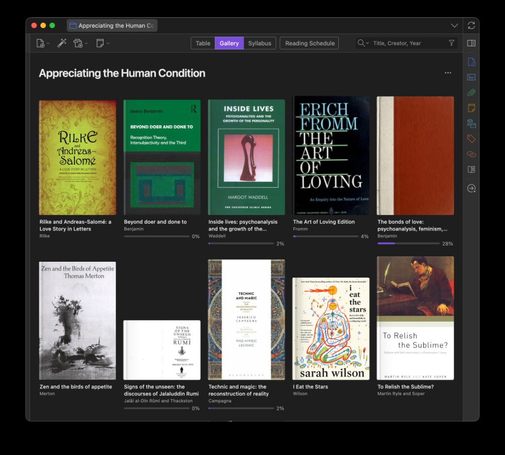

# Zotero Syllabus


A Zotero add-on / plugin that turns your collections into syllabi and course reading lists. Order items by class, browse them in Gallery, keep a Home of what to open next, follow due dates on Reading Schedule, and review highlights in Annotation Feed.

**Documentation:** [janbaykara.github.io/zotero-syllabus](https://janbaykara.github.io/zotero-syllabus/) (also **Help → Zotero Syllabus Documentation** in the app).

Changing the plugin? Architecture, storage, and local development are in **[doc/TECHNICAL.md](doc/TECHNICAL.md)**. UI strings must go through Fluent (`addon/locale/`); see the [localization](doc/TECHNICAL.md#localization) section.

## How to install

1. [Download the extension file (.xpi)](https://github.com/janbaykara/zotero-syllabus/releases/latest/download/zotero-syllabus.xpi).
2. In the Zotero menu bar, go to `Tools` → `Plugins` (or `Add-ons`)
3. Click the gear icon in the top right corner and select `Install Plugin From File...`
4. Select the downloaded `.xpi` file
5. (Ensure auto-updating is enabled for this add-on too!)
6. Restart Zotero!

> [!NOTE]
> For best results, use [Zotero 8, 9, or 10](https://www.zotero.org/download/). Zotero 7 works but has some minor styling issues.

The plugin UI follows **Zotero’s language** (Settings → General → Language). Besides English and Simplified Chinese, that includes Brazilian and European Portuguese, German, Spanish, French, Italian, Japanese, Korean, Traditional Chinese, Dutch, Polish, Turkish, Arabic, Indonesian, Russian, Ukrainian, and Vietnamese.




## Can YOU spare 15 minutes to tell me how you're using the tool?

A message from Jan, the software developer:

> Hey all! According to Github over 350+ people have downloaded the extension so far. Great!
>
> To help improve the plugin for students, would you be up for a quick 15 min Zoom call? ([Here's the booking link.](https://calendly.com/janbaykara-pm/30min)) We'd talk through how you're using the tool, how you found getting started, and what could be improved to improve studying with Zotero.
>
> I'm particularly interested to improve the onboarding / documentation / accessibility of the tool, but your thoughts might also help shape new features! I'll be listening as a software developer, as a fellow student, and as student of pedagogy in particular!
>
> If you can spare 15 minutes, here's a booking link: [https://calendly.com/janbaykara-pm/30min](https://calendly.com/janbaykara-pm/30min) - Pick a slot and I look forward to chatting!
>
> — Jan :)

## Discussion

- For **bug reports** and **feature requests**, please use the [GitHub Issues](https://github.com/janbaykara/zotero-syllabus/issues) page.
- For **general discussion**, join the [Discord](https://discord.gg/PtEY5DxCea), or use the [Zotero Forum Thread](https://forums.zotero.org/discussion/128688/zotero-syllabus-a-plugin-for-managing-your-uni-course-reading-lists) or [Reddit Thread](https://www.reddit.com/r/zotero/comments/1w3eu97/zotero_syllabus_a_plugin_for_students_to_organise/).

## Show your thanks by donating 🙏🇵🇸🕊️

If this project is useful to you, [Buy Me a Coffee](https://buymeacoffee.com/janbaykara) and I will regularly donate proceeds to third party funds, including those that help keep **Gaza's universities, students, and academic life alive** during reconstruction, following the genocide of the Palestinian people by the Israeli-American occupation:

- **ISNAD — Emergency Fund for Gaza’s Universities (via Taawon / Welfare Association)**  
  Primary Palestinian-led programme supporting scholarships, staff, and core university operations.  
  [https://taawon.org/en/isnad](https://taawon.org/en/isnad)
- **Friends of Palestinian Universities (FoPU / Fobzu)**  
  Long-standing UK charity supporting Palestinian universities, including emergency work for Gaza.  
  [https://fobzu.org](https://fobzu.org)

Supporting these funds helps sustain students, staff, research, and educational infrastructure — the foundations for rebuilding Gaza’s higher-education system.

_Thank you for contributing in solidarity._

Same page on the docs site: [Supporting Gaza’s academic reconstruction](https://janbaykara.github.io/zotero-syllabus/support-gaza/).

## User manual

Full, user-friendly documentation lives on the docs site:

**[https://janbaykara.github.io/zotero-syllabus/](https://janbaykara.github.io/zotero-syllabus/)**

In Zotero, open it anytime from **Help → Zotero Syllabus Documentation**. For a short walkthrough in the app, use **Help → Open Zotero Syllabus User Guide**.

The plugin has five surfaces (toggle in **Preferences → Zotero Syllabus → Views**):

1. **Syllabus** — structure a collection by class.
2. **Reading Schedule** — due dates across all your syllabi.
3. **Gallery** — browse a collection as covers, cards, or a preview.
4. **Home** — library shelves for what to open next.
5. **Annotation Feed** — your highlights in one timeline.

Shared tools: pinning, Gallery notes, [publishing a collection](https://janbaykara.github.io/zotero-syllabus/how-to/print-export-publish/) (syllabus or reading list), and [importing a reading list](https://janbaykara.github.io/zotero-syllabus/how-to/import-reading-lists/) from the browser. Start with the [student](https://janbaykara.github.io/zotero-syllabus/tutorials/student/), [educator](https://janbaykara.github.io/zotero-syllabus/tutorials/educator/), or [researcher](https://janbaykara.github.io/zotero-syllabus/tutorials/researcher/) tutorial.

## API

Other Zotero plugins (and scripts such as [Actions & Tags](https://github.com/windingwind/zotero-actions-tags)) can call Syllabus via `Zotero.Syllabus.api`. Always wait until the plugin is ready:

```js
await Zotero.Syllabus.api.whenReady();

const collection = ZoteroPane.getSelectedCollection();
if (collection && Zotero.Syllabus.api.syllabus.has(collection)) {
  const metadata = Zotero.Syllabus.api.syllabus.getMetadata(collection.id);
  Zotero.Syllabus.api.view.openSyllabus(collection.id);
}
```

Modules (full reference: [docs → API](https://janbaykara.github.io/zotero-syllabus/api/variables/syllabusapi/), source `[src/api.ts](src/api.ts)`):

- `syllabus` — has / ensure, metadata, lock, document snapshot, dictionary
- `class` — add / delete / ensure, titles, reading dates, status
- `assignment` — get / set / add / remove assignments; add items to a class
- `view` — open Syllabus / Reading Schedule / Annotation Feed; collection view mode
- `pinned` — pin / unpin items and syllabi; list pinned
- `personal` — personal reading order and done state

Top-level helpers: `version`, `isReady()`, `whenReady()`. The docs site regenerates the API pages from TypeScript on every `pnpm docs:build` ([starlight-typedoc](https://starlight-typedoc.vercel.app/)).

## Development

Contributions are welcome — please open a Pull Request.

See **[doc/TECHNICAL.md](doc/TECHNICAL.md)** for how the plugin stores syllabi, handles item merges, class folders, reading-list translators, and the rest of the architecture, as well as build, test, lint, and release commands.

To run locally: clone the repo, `pnpm install`, copy `.env.example` to `.env` (set your Zotero path), then `pnpm start`. Requires Zotero 7+ (8–10 recommended), Node.js LTS, Git, and pnpm.

This plugin is built using the [Zotero Plugin Template](https://github.com/windingwind/zotero-plugin-template).

## Acknowledgements

Thanks to the following:

- The authors of all syllabi everywhere — [Teacher As Author](https://rl.talis.com/3/ucl/lists/38afa403-9ebf-4dbe-86b0-a80e564f9777.html) — including the project author's own lecturers (Community Education faculty at UWS; the Politics department at SOAS), and those who teach outside formal academic institutions.
- Academic institutions for sharing their syllabi, and platforms such as [Talis](https://www.talis.com), [Ex Libris Leganto](https://exlibrisgroup.com/products/leganto-reading-list-management-system/), [KeyLinks](https://kortext.com/keylinks/), [eReserve Plus](https://www.ereserve.com.au/), and [BLUEcloud Course Lists](https://www.sirsidynix.com/bluecloud-course-lists/) that make it possible to download this data easily.
- The [RIS](<https://en.wikipedia.org/wiki/RIS_(file_format)>) (Research Information Systems) format, which makes bibliographic records portable between tools.
- [Zotero](https://www.zotero.org)'s developers, for building an open platform, and for recent developments that have opened plugin development to contemporary web technologies.
- The Zotero plugin toolkit community, including [zotero-plugin-template](https://github.com/windingwind/zotero-plugin-template) and [zotero-plugin-toolkit](https://github.com/windingwind/zotero-plugin-toolkit).
- The authors of the open-source libraries this plugin relies on, among them [Preact](https://preactjs.com), [React](https://react.dev), [Zod](https://zod.dev), [Tailwind CSS](https://tailwindcss.com), and [esbuild](https://esbuild.github.io).
- Early users, for a steer and encouraging words.
