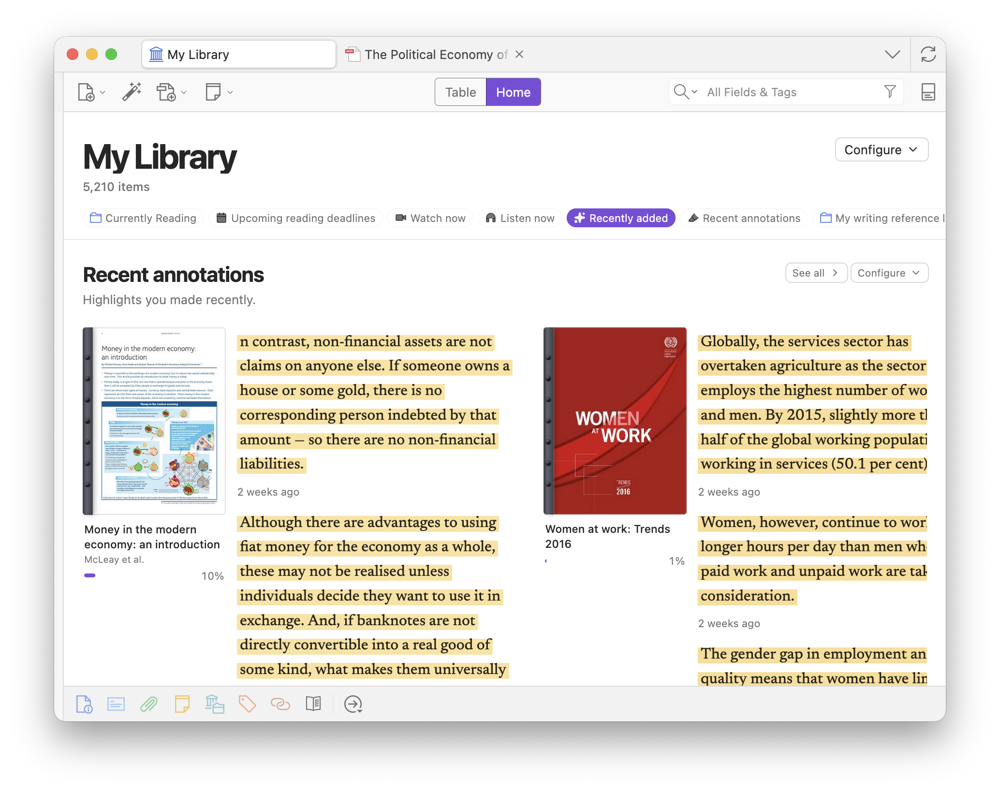

At the **library root**, switch to **Home** for shelves of what to open next.

## Default shelves

- **[Pinned](/zotero-syllabus/how-to/pinning/)**
- **Upcoming reading deadlines**
- **Watch now**
- **Listen now**
- **Recently read**
- **Recently added**

You can also add **Recent in feed** and **Recent annotations**, plus any collection or saved search.

## Configure shelves

- **Configure** (top right) shows, hides, and reorders shelves.
- Right-click any collection in the sidebar → **Add to Home** to put it on this list (not the same as [pinning](/zotero-syllabus/how-to/pinning/)).
- Each shelf has its own **Configure** for layout (and sort / group on collection shelves). **Remove shelf** hides it; turn it back on from Home Configure.
- **Go to Reading Schedule** and **Go to Annotation Feed** jump to those tabs from the matching shelves.
