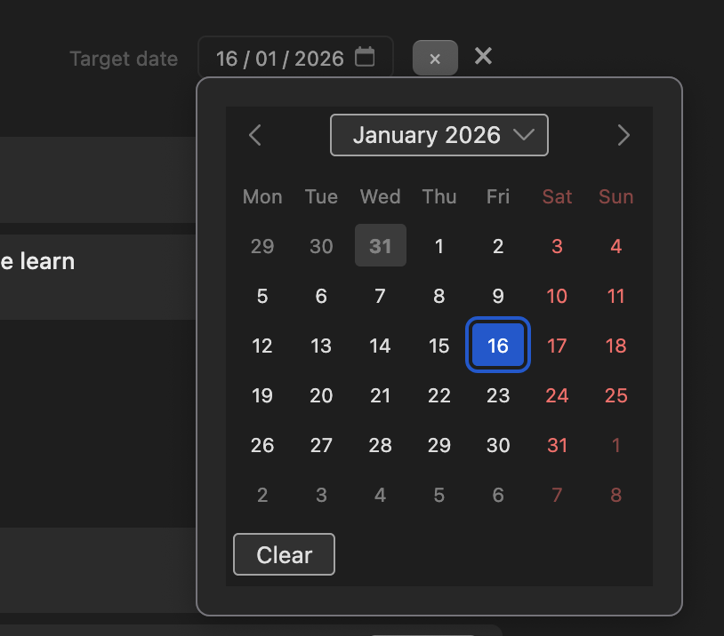

A calendar of class due dates across your syllabi, so you can see what is due this week and next.

## Open Reading Schedule

1. Enable it in **Preferences → Zotero Syllabus → Views**.
2. Open the **Reading Schedule** tab (toolbar button, or **Go to Reading Schedule** from the Home deadlines shelf).

## Set dates on classes

1. In Syllabus view, set a **reading date** on a class.

   

2. Those classes appear on the schedule, grouped by week and date. Sticky week / date / class headers stay visible as you scroll.
3. The same Card / Cover / Magazine / Annotations layouts as [Gallery](/zotero-syllabus/how-to/gallery/) are available from the header menu.
4. A **[Pinned](/zotero-syllabus/how-to/pinning/)** section sits above the calendar.

## Optional Reading Schedule collection

**Preferences → Zotero Syllabus → Generate a “Reading Schedule” collection** creates an auto-managed folder tree for upcoming dates (and a `Pinned` child folder). Do not add or remove items there by hand; turn the pref off to delete that collection. Syllabus items stay in place.

See [Auto-managed folders](/zotero-syllabus/concepts/auto-managed-folders/).
