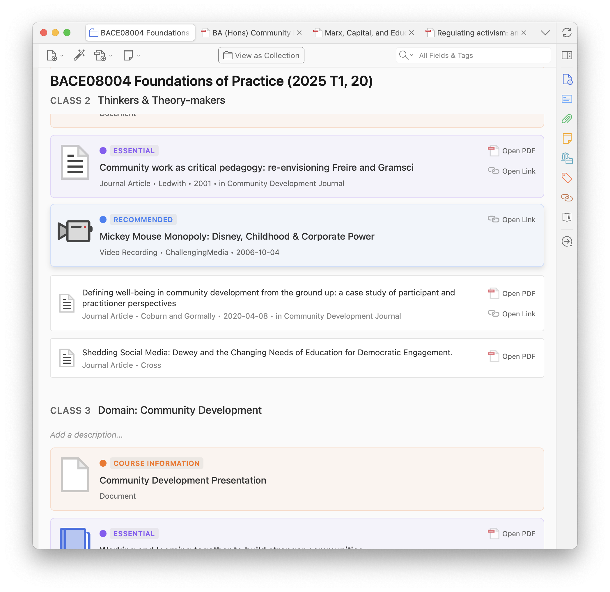
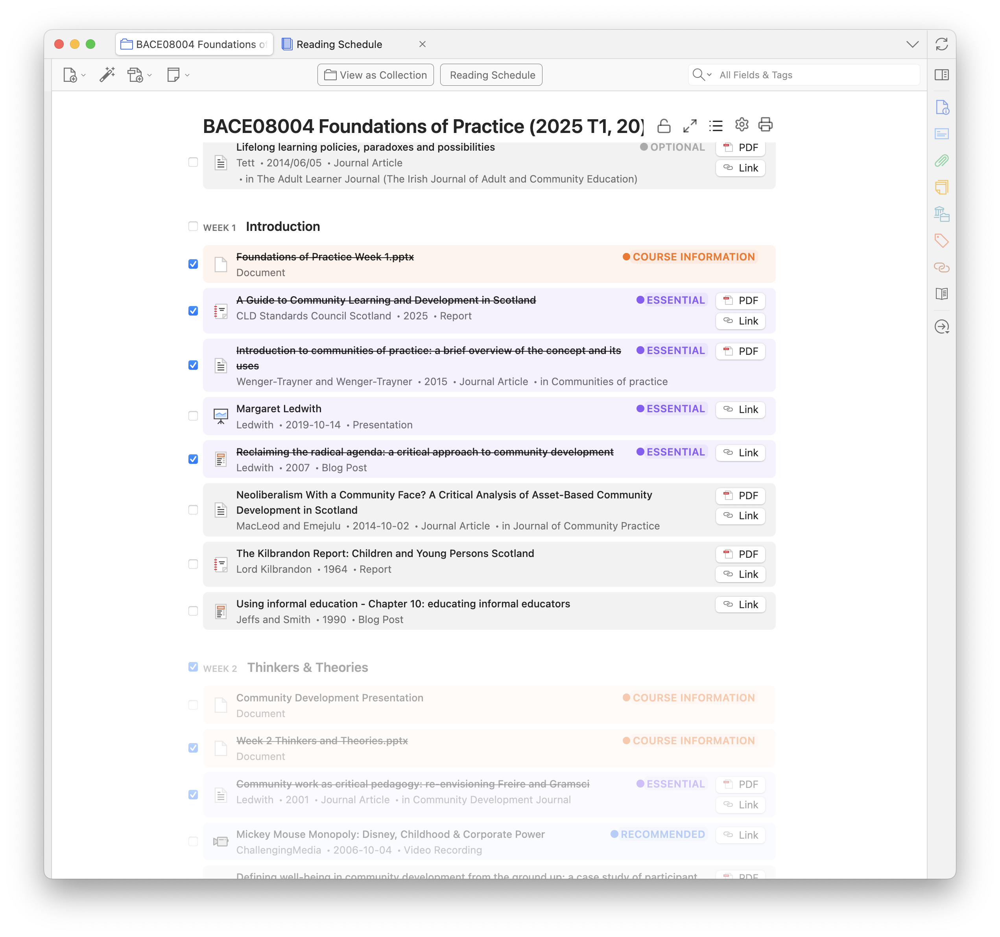
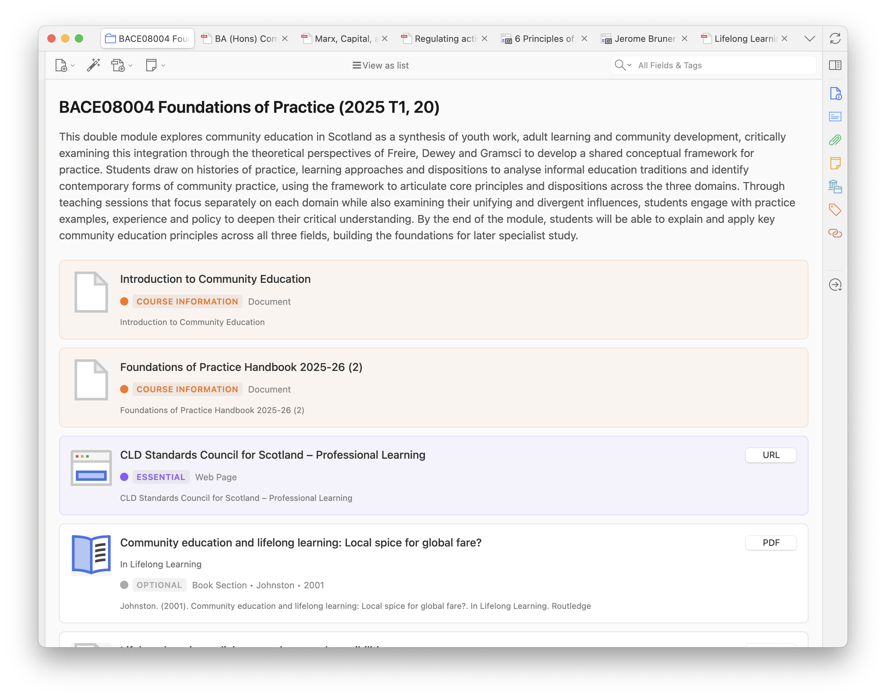
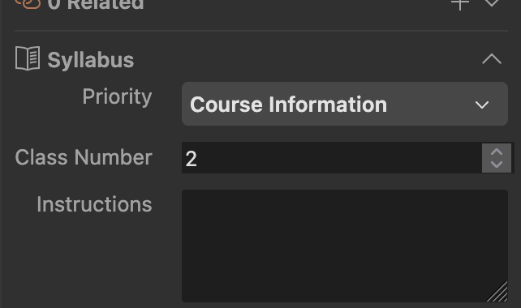
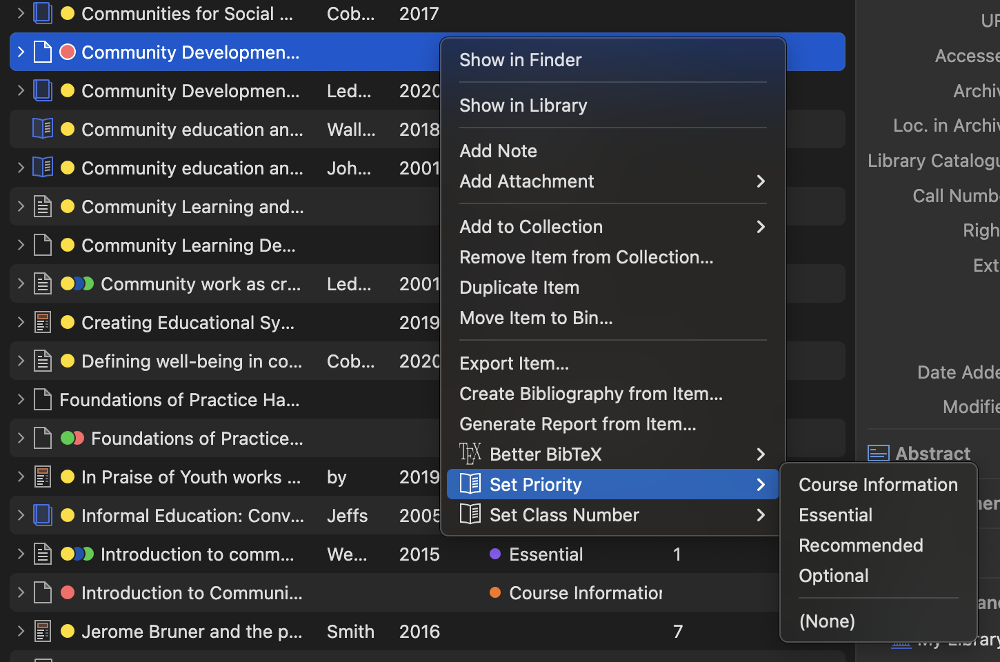
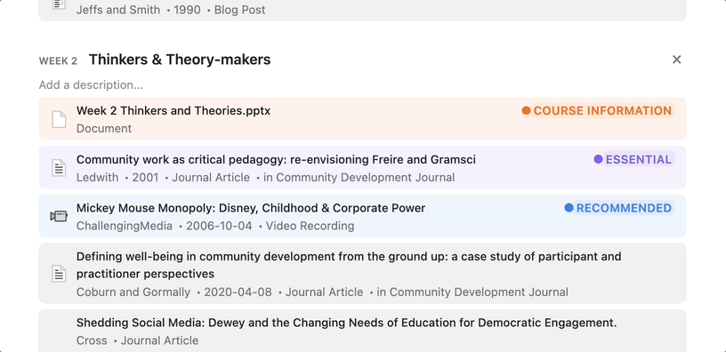
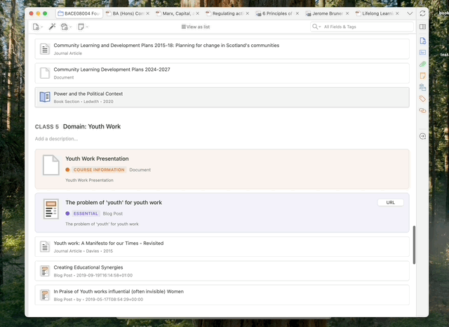
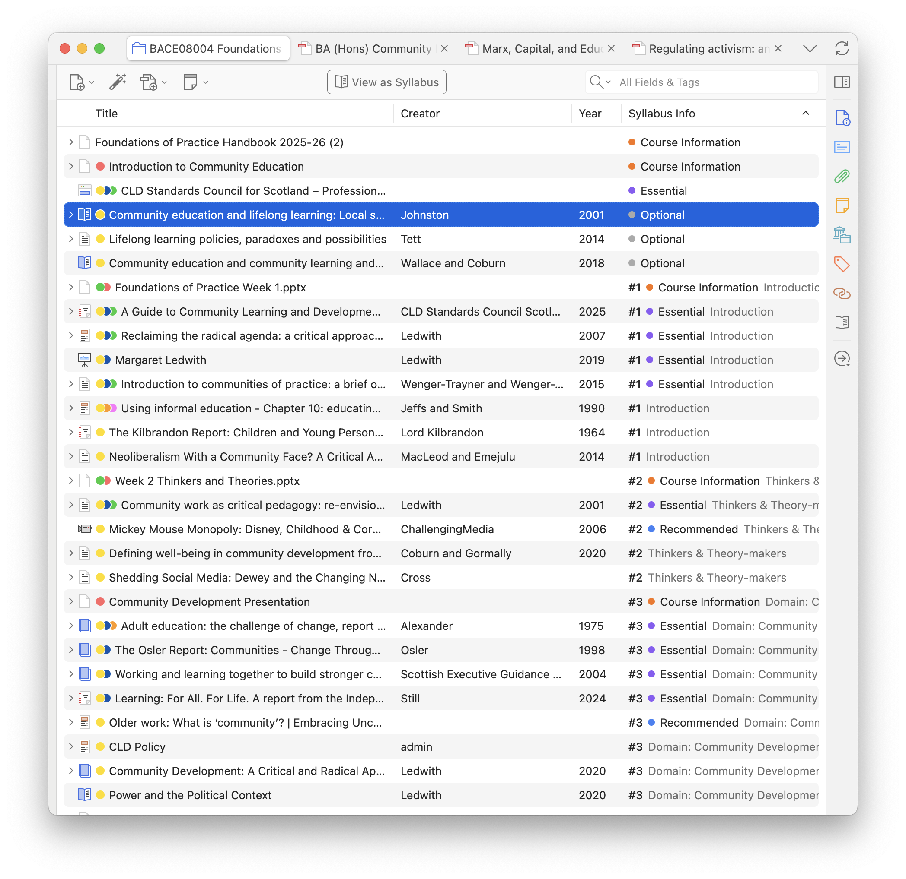

Structure a collection by class (or week / session — you choose the word). Assign readings, set priorities and instructions, drag items into place, and export or publish the list.

## Open a syllabus

1. Select the collection.
2. Click **Turn into Syllabus** (first time) or **Syllabus** in the items toolbar.

Auto-managed folders (Reading Schedule, class folders) use **Checklist** instead of Syllabus.

## Classes and assignments

Add classes with **Add Class**, or right-click an item → **Assign to a class → Add to new class**.

Then assign readings by:

- Dragging an item onto a class in Syllabus view.
- Right-click → **Assign to a class** and picking the class (the current syllabus, or another syllabus in the submenu).
- Right-click → **Assign to a class → Search classes…**, or **Add to class…** in the item pane, to search every syllabus. This works even when the item pane is closed.

An item can be assigned more than once (useful for breaking a long reading into chunks). Hover an item in Syllabus view and use **Duplicate**. If you merge duplicate items in Zotero, the surviving item keeps its class assignment.

Unassigned items stay under **Further reading**.

Give each class a title, description, and optional [reading date](/zotero-syllabus/how-to/reading-schedule/). Mark a class or an item **done** to track what you have already read.

## Course documents

Give items the **Course Information** priority (or your own top priority) so handouts and links stay at the top of the syllabus. This is not the same as [pinning](/zotero-syllabus/how-to/pinning/) an item to Home or Reading Schedule.

## Reading instructions, priority, and done

Use the **Reading assignments** section in the item pane to set class, instruction, priority, and done status. **Add to class…** there (or in the item context menu) assigns the selected item to any class on any syllabus, and adds it to that collection if needed.

Right-click an item to change class or priority without opening the pane.

Default priorities are Essential, Recommended, Optional, and Course Information. Edit names, colors, and order in Syllabus **Settings**, or set library-wide defaults in Preferences.

## Reorder and move

Drag to reorder within a class, or reset to natural order. Drag between classes to move an assignment.

In **Table** view, a sortable **Syllabus Class / Assignment** column summarises class, priority, and status. Sort by it to see readings in syllabus order.

## Settings, lock, and class folders

The header has **Settings** (nomenclature such as week / class / session, priorities, bibliography, class subcollections), **Lock** (read-only for studying), **Print**, and [Pin collection](/zotero-syllabus/how-to/pinning/).

**Class subcollections** is off by default. When on, the plugin creates a child folder per class and keeps membership in sync. Do not add or remove items in those folders by hand. Leave this off unless you want folder mirrors. See [Auto-managed folders](/zotero-syllabus/concepts/auto-managed-folders/).

If the [Zotero Reading List](https://github.com/Dominic-DallOsto/zotero-reading-list) plugin is installed, its reading status appears in Syllabus view.

## Class notes

Standalone notes in the collection can be assigned to a class like any reading. They use the same Syllabus cards and ordering, with a fixed yellow **Class Note** label instead of a priority. See [Class notes](/zotero-syllabus/concepts/class-notes/).

## Save, print, and publish

See [Print, export, and publish](/zotero-syllabus/how-to/print-export-publish/). You can also [import a reading list](/zotero-syllabus/how-to/import-reading-lists/) from the browser.
