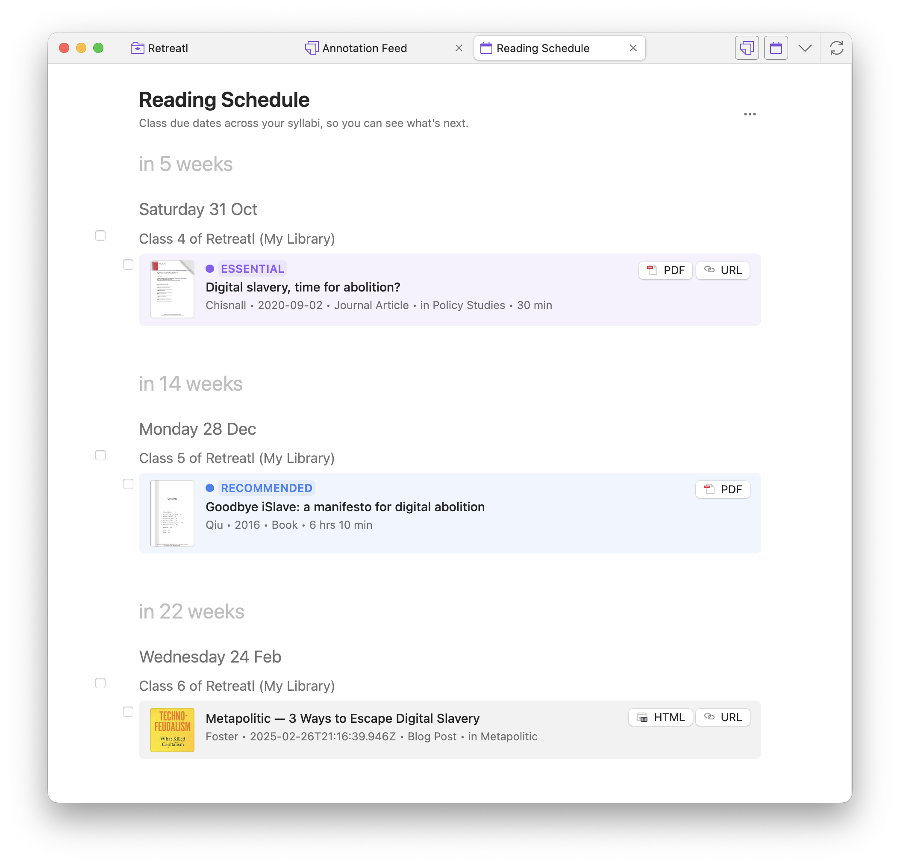

This walkthrough assumes you already use Zotero and have the [Zotero Connector](https://www.zotero.org/download/connectors) in your browser. Goal: one course collection you can study from by the end of the week.

## 1. Install the plugin

Follow [Getting started](/zotero-syllabus/getting-started/) if you have not installed yet. Prefer Zotero 8 or later — reading-list import needs it.

## 2. Import your institutional reading list

If your university publishes lists on Talis Aspire, Leganto, KeyLinks, eReserve, or BLUEcloud Course Lists:

1. Open the list in the browser and wait until the readings are visible (sign in with SSO if needed).
2. Click the Zotero Connector button and save the page.
3. In Zotero, open the new top-level collection and switch to **Syllabus**.

Details and supported platforms: [Import a reading list](/zotero-syllabus/how-to/import-reading-lists/).

If you do not have an institutional list, create a collection, add items as usual, click **Turn into Syllabus**, then [assign classes by hand](/zotero-syllabus/how-to/syllabus/).

## 3. Check classes and due dates

In Syllabus view:

1. Skim class titles — rename or merge if the import split weeks oddly.
2. Set a **reading date** on each class you care about this term.
3. Mark **done** on anything you have already finished.

Those dates appear on [Reading Schedule](/zotero-syllabus/how-to/reading-schedule/).

## 4. Pin what you are working on now

- Right-click the course collection → **Pin collection**, or use the pin on the syllabus header.
- Right-click a paper you must finish → **Add to Pinned**.

Pinned items and collections show on **Home** and at the top of Reading Schedule. See [Pinning](/zotero-syllabus/how-to/pinning/).

## 5. Use Home as your daily start

At the **library root**, switch to **Home**. Default shelves include Pinned, upcoming deadlines, recently read, and more. Configure shelves from the top-right **Configure** control.

## 6. Study with Lock

On the syllabus header, click **Lock**. The view becomes read-only so you do not accidentally drag or reassign while reading. Unlock when you need to edit again.

## Checklist for week one

- [ ] Plugin installed; Views you need are on in Preferences
- [ ] Course collection exists as a syllabus
- [ ] Reading dates set for upcoming classes
- [ ] Collection or key items pinned
- [ ] You know how to open Reading Schedule and Home

When something is unclear, see the [how-to guides](/zotero-syllabus/how-to/syllabus/) or [ask in Community](/zotero-syllabus/community/).
